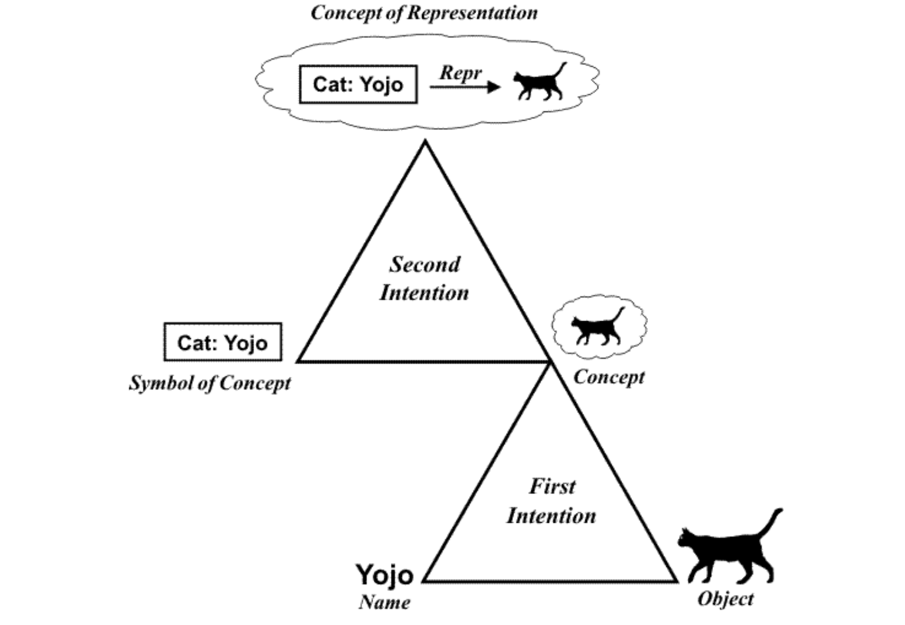
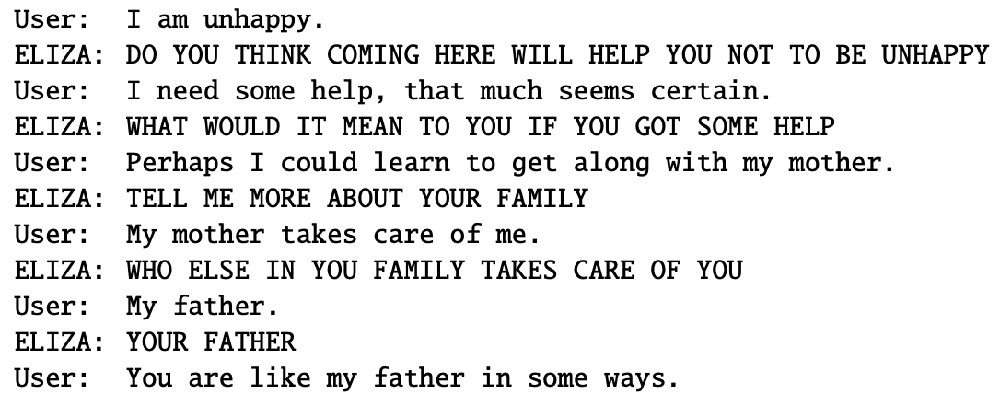
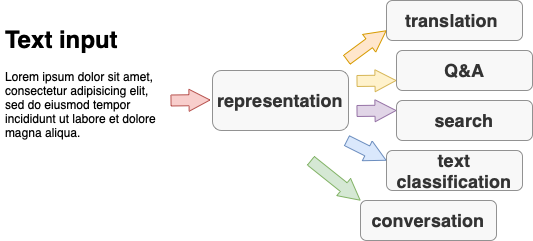

## 1. Large language models (LLMs), Artificial Intelligence (AI) and Natural language processing (NLP), history of NLP

>  Explanations, formulas, visualisations: 
> - Britannica entry for [artificial intelligence](https://www.britannica.com/technology/artificial-intelligence) 
> - Eisenstein 1.1
> - Jurafsky-Martin [2](https://web.stanford.edu/~jurafsky/slp3/2.pdf) 
> - Benoît Sagot, Apprendre les langues aux machines, [leçon inaugurale](https://www.college-de-france.fr/fr/agenda/opening-lecture/apprendre-les-langues-aux-machines-0), Collège de France 
> - Melanie Mitchell, [The Turing Test and our shifting conceptions of intelligence](https://www.science.org/doi/10.1126/science.adq9356), Science

&nbsp; 

### NLP at the intersection of three disciplines 

- NLP is an important part of artificial intelligence because language is the most prominent capacity of human intelligence. 
- The Turing test: another reason why language is central to AI
    - Not a test in fact, but a thought experiment
- ELIZA: a case that shows how easily humans are tricked into ascribing human traits to machines 
- Linguistics was central to language processing in the past, before the introduction of machine learning. Currently we see a big gap between linguistics and NLP, but the potential for bridging this gap is still there.
- Language processing was one of the first applications of machine learning and it remains a prominent challenge.

&nbsp; 

### Human vs. machine language competence 

&nbsp; 

[Source](https://www.researchgate.net/publication/226728046\_The\_Role\_of_Logic_and_Ontology_in_Language_and_Reasoning)

&nbsp; 

[Source](https://web.stanford.edu/~jurafsky/slp3/2.pdf)
 

- Humans use language to name (maybe even to form) concepts by abstracting from real objects and events
- Regular expressions describe explicitly the structure of text (as a sequence of symbols), natural languages is similar but more complex 
- Machine learning results in implicit knowledge, so that machines can imitate how humans use language without any access to concepts and reality
- Modern machines do develop some concepts, but the relationship with the reality is still missing 

&nbsp;

### Three big eras in the history of NLP

&nbsp; 

### Current pipeline

---

&nbsp; 