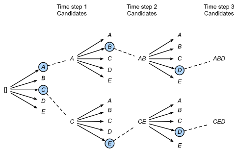

## 10. Transfer learning: Performing tasks with decoder-type pre-trained models

> Explanations and visualisations: 
> - Jurafsky-Martin [7](https://web.stanford.edu/~jurafsky/slp3/7.pdf)
> - Lena Voita's blog: [Transfer Learning](https://lena-voita.github.io/nlp_course/transfer_learning.html#bert)
> - Jay Alammar's blog: [The Illustrated GPT-2](http://jalammar.github.io/illustrated-gpt2/)

&nbsp; 

*Source: https://d2l.ai/chapter_recurrent-modern/beam-search.html*

&nbsp; 

### BERT (Bidirectional Encoder Representations from Transformers ) vs. GPT (Generative Pre-trained Transformer) 

- They are both pre-trained on text by guessing tokens, BERT pre-training objective is to predict randomly masked tokens, GPT predict the next word 
- The key difference in pre-training is that GPT takes its own output generated at previous steps for the current prediction, BERT does not use its own output for anything but evaluating the loss 
- Apart from the pre-training objective, BERT does not do anything else, an additional small network (or a linear classifier) needs to be added to it in order to perform NLP tasks
- GPT can generate text without any additions, but this is rarely a useful output, additional components are needed here too to perform NLP tasks 
- BERT is pre-trained specifically for tracking relations between sentences, it is pre-trained on pairs of sentences with an additional pre-training objective: predicting for any two given sentence whether they are adjacent or not 
- The special tokens [CLS] and [SEP] are only used in BERT pre-training
- BERT-based models tend to be much smaller than GPT-based
- **Note**: Masked Language Modelling objective in BERT is not to be confused with Masked Self-attention in GPT! 

### Decoding vs. prediction

- Prediction is a more general term, this is the decision what label to output for an input instance, given the parameters of the model
- Decoding is the term used when we optimise a sequence of predictions: the decision on what label to output at a given step in the sequence depends on all the other decisions in the sequence
- There are many decoding strategies, in all of them, we try to consider **multiple plausible options at each step**, popular strategies: 
    - Greedy search
    - Beam search 
    - Random sampling
    - Temperature sampling
- Even though it outputs a representation for each token in the sequence, BERT is not decoding
- GPT is decoding, but also encoding implicitly  

### GPT after pre-training 

- **Prompting**: we give a pre-trained model a string of text and it responds by continuing the string, the model considers our string as if it had generated it in previous steps, so the prompt can be used to control a model's behaviour to some point     
- **Instruction-tuning**: our string can be an instruction and the model's continuation the response to our instruction, e.g. *translate*, to "know" what it needs to do when it receives the instruction *translate*, GPT needs to be trained specifically for that: it is given a lot of examples of instructions and the responses and it learns (adjusts the pre-trained weights) to predict the response given the instruction
- **Human-in-the-Loop Reinforcement Learning**: the model gets a score, a *reward* for its response and can adjust the response in the next iteration 
- **Direct preference optimisation**: and alternative to reinforcement learning 
- To perform NLP tasks, we need to pass them as instructions

### Pre-training, training, testing (summary)

- **Pre-training**: the model sees tokenised text, not annotated, it learns to represent a sequences of tokens by predicting tokens
- **Training**: the models sees structured annotated data, e.g. tokens with NER labels, questions with answers, instructions with responses; GPT sees the labels as the continuation to predict, the input part of the training data (tokens, questions, instructions) is the prefix, the model first represents the prefix using the pre-trained weights, then learns to continue the sequence in the way determined by the training data 
    - *Fine-tuning*: adjusting the pre-training weights too while learning the task  
- **Testing**: a model is given the input part and is expected to output the label as a continuation
- **In-context learning** is a special form of prompting a trained model to elicit better answers **without updating the weights**; we give a few examples of the task and then let the model complete a new example, a more adequate term would be *in-context induction*.  

