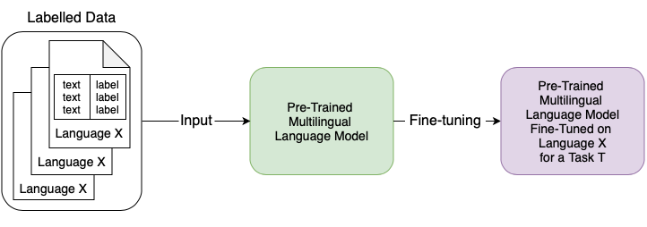
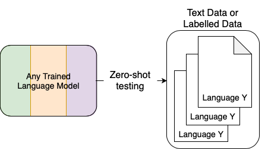
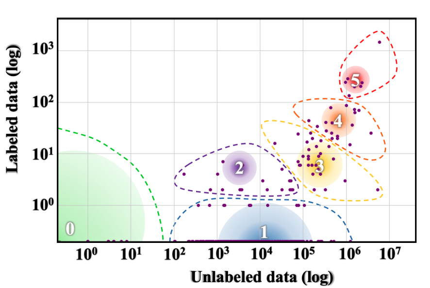
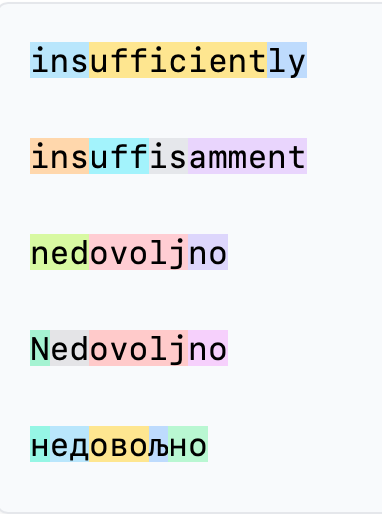
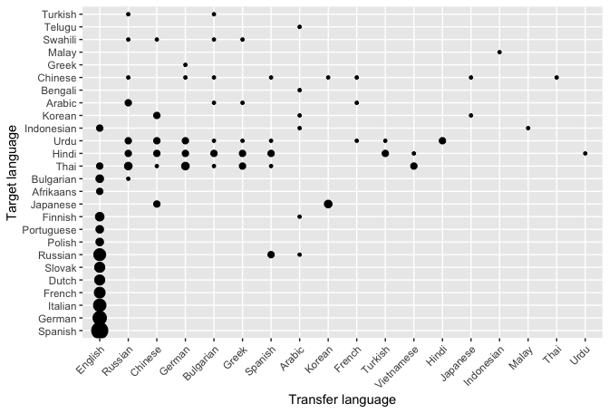

## 11. Cross-lingual transfer and multilingual NLP

Explanations and visualisations 

> - Crash Course Linguistics [#16](https://youtu.be/-sUUWyo4RZQ)
> - [Language sampling](https://github.com/tsamardzic/lsampling)
> - [Beto, Bentz, Becas: The Surprising Cross-Lingual Effectiveness of BERT](https://arxiv.org/pdf/1904.09077)
> - [The State and Fate of Linguistic Diversity and Inclusion in the NLP World](https://aclanthology.org/2020.acl-main.560.pdf) 
> - [No Language Left Behind: Scaling Human-Centered Machine Translation](https://arxiv.org/abs/2207.04672)
> - [Connecting Language Technologies with Rich, Diverse Data Sources Covering Thousands of Languages](https://aclanthology.org/2024.lrec-main.331.pdf)

&nbsp; 

&nbsp; 

### Cross-lingual transfer

- In principle, we can pre-train a model on one language and use it to process texts in another language
- Most often, we pre-train models on multiple languages and then use this multilingual model to process texts in any given single language
- **Target language** is the language in which we want to perform a task (process texts)
- **Transfer language** is the language in which we have a lot of labelled data, we fine-tune a pre-trained multilingual model on the transfer language and then apply it (often as zero-shot) to a different target language.   
- **Double transfer**: when we transfer a model across languages and fine-tune it for a given task, there are two transfer steps, one across languages and one across tasks 
- **(Continued) training**: if we have some unlabelled data in the target language, we can continue training the model with the pre-training objective before fine-tuning it for a given task 
- *Zero-shot*: we attempt to perform a task without fine-tuning and continued training 
- Pre-trained model can be a **bare LM** or **trained/fine-tuned** for a specific task 
- An interesting example is the Helsinki team solution to the [AmericasNLP](https://github.com/AmericasNLP/americasnlp2024/tree/master/ST1_MachineTranslation) task of translating from Spanish into low-resource languages: for each pair Spanish - TARGET, train a on Spanish - English for 90% of the time, then continue on Spanish - TARGET for 10% of the time, best results for all TARGET languages     

&nbsp; 

### Labelled vs. unlabelled data 

*Source https://aclanthology.org/2020.acl-main.560.pdf*

&nbsp;  

#### Examples of unlabelled multilingual data sets:
- Bible 100, 103 languages, 30 families, Majority non-Indo-European  
- mBERT, 97 languages, 15 families, Top 100 size of Wikipedia plus Thai and Mongolian

#### Examples of parallel data (for machine translation), considered labelled
- OPUS,  744 languages
- FLORES+ (by NLLB), 222 languages

#### Examples of labelled multilingual data sets

- Text parsing tasks:  Universal Dependencies (UD) v2.17 has 186 languages
- End-user tasks: 
    - [XTREME](https://sites.research.google/xtreme),  40 languages (used for training XML-R) 
    - [XGLUE](https://microsoft.github.io/XGLUE/), 19 languages 
    - [XNLI](https://github.com/facebookresearch/XNLI), 15 languages
    - [XCOPA](https://github.com/cambridgeltl/xcopa),  11 languages 
    - [TyDiQA](https://github.com/google-research-datasets/tydiqa), 11 languages
    - [XQuAD](https://github.com/deepmind/xquad), 12 languages
    - [MMLU-ProX](https://mmluprox.github.io/), 29 languages 
    - [Okapi]((https://github.com/microsoft/Okapi), 26 languages (actually 27)
    - [BenchMAX](https://github.com/CONE-MT/BenchMAX), 17 languages

Many multilingual data sets are created from a selection of data taken from Common Crawl.

&nbsp; 

### Examples of multilingual pre-trained models

- BERT-type
    - mBERT was the first, trained on top 100 Wikipedia languages, plus a few arbitrary ones
    - XML-R, a BERT-based model, currently most popular as a starting point for multilingual experiments
- GPT-type: BLOOMZ, Falcon, Phi, Llama, Gemma, Mistral, SILMA, Qwen, Apertus, Olmo 
- Full Transformers: mT5 
- Multiple encoder-decoder (not transformers): NLLB

Other pre-trained models are typically trained for a single language or a group of languages (e.g. Indic BERT, AraBERT, BERTić)  

&nbsp; 

### Multilingual tokenisation and script issues 

*Source https://tiktokenizer.vercel.app*

- Multilingual tokenisers are trained over all languages in the data set, the resulting vocabulary is shared. 
- Since the data size is very different, the shared vocabulary will be mostly filled with frequent words of languages with a lot of data (English)
- The structure of language also impacts the tokenisation: if words are shorter they are more frequent, more chance to be found in a multilingual vocabulary 
- The script has impact too: non-Latin scripts are rare, words written in non-Latin script will be overall rare, little chance to be found in a multilingual vocabulary 
- **Oversegmentation** happens when the shared vocabulary does not contain longer substrings of an input word, so it segments it into very short substrings
- **Fertility** is a measure showing into how many subwords words are split by a tokeniser, higher when words are long, rare, written in non-Latin script
- **Parity** is a measure showing how many (more) tokens there are in a sentence of a language compared to the equivalent English sentence 
- **Subsampling** is a technique used to balance the frequency of items in a multilingual data set: sample try to learn the tokenisation vocabulary from the same amount of data from all languages 

### Language similarity and transfer

&nbsp; 

- If the target language is seen in pre-training, the performance will be better
- There is a trade-off between the size of the training data and the closeness to the target language 
- It is not easy to predict which will be good transfer-target pairs 
- Often BERT base (only English) works best even if the target language is very distant

&nbsp; 

### Language features

- To measure distances between languages, we represent each language as a vector 
- One-hot encodings are used as language IDs 
- Three types of features: 
    - **Metadata**: number of speakers, geographical location, resource availability 
    - **Typology**: phylogenetic classification (which language family), structural descriptions from typological data bases: [WALS](https://wals.info), [Glottolog](https://glottolog.org), [URIEL](https://www.cs.cmu.edu/~dmortens/projects/7_project/) (derived from WALS, Glottolog and some other sources), [Grambank](https://grambank.clld.org); actual features in the existing databases need to be processed (converted into binary features)    
    - **Text-based**: e.g. character-level token-type ratio, word-level token-type ratio, average distance between space characters, median word length, text entropy,  vectors learned from text samples (use a special language token)  

&nbsp; 

### Benefits of multilingual NLP

- Linguistic and machine learning: bigger challenges lead to better approaches, e.g. subword tokenisation  
- Cultural and normative: better representation of the real world knowledge
- Cognitive: learn interlingual abstractions  

&nbsp; 
