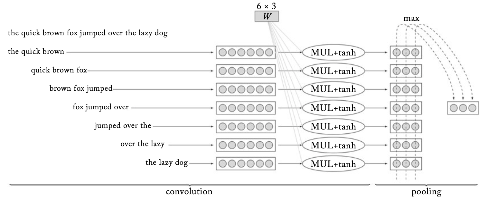

## 11. History of NN architectures in NLP: CNNs, LSTMs 

> Explanations, formulas, visualisations: 
> - Lena Voita's blog: [Text Classification](https://lena-voita.github.io/nlp_course/text_classification.html)
> - Chris Olah, [Understanding LSTM Networks](http://colah.github.io/posts/2015-08-Understanding-LSTMs/)
> - Goldberg 9, 10, 11
> - Eisenstein 3.4, 6 
> - Jurafsky-Martin [8](https://web.stanford.edu/~jurafsky/slp3/8.pdf)

&nbsp; 

### RNNs 

*Source: [Understanding LSTM Networks](http://colah.github.io/posts/2015-08-Understanding-LSTMs/)*

- RNNs are designed to process sequences, when **the order** of symbols is important 
- Hidden layers of RNNs model the whole sequence, each token in the input is represented with a hidden state 
- The hidden states can be seen as layers of a deep network (often called **units**) connected via the RNN abstraction 
- The **RNN abstraction**: current state = current input +  previous state 
- By design uni-directional, in NLP mostly used as **bi-directional**: concatenation of the left-to-right and right-to-left pass
- Classifiers vs. transducers: if an RNN outputs a symbol or a decision only at the end of the sequence, it can be seen as a classifier (also called acceptor), if it outputs a symbol at each step, it is a transducer <- the terminology comes from finite-state automata 
- *Varied length*: RNNs are the only architecture that can deal with varied sequence length!

&nbsp; 

### LSTMs are gated RNNs 

*Source: [Understanding LSTM Networks](http://colah.github.io/posts/2015-08-Understanding-LSTMs/)*

- **Gating** is invented to control how much history is allowed to pass to the next state, **gated RNN units** have more structure than simple RNN unit  
- **LSTM** is a kind of gating: each state consists of a **hidden** and a **memory** (also called context) component
- Hidden component is the main unit, memory is additional unit that helps gating
- Gates: input, forget, output  

 
&nbsp; 

### CNNs as feature extractors 

*Source: [A Primer on Neural Network Models for Natural Language Processing](https://u.cs.biu.ac.il/~yogo/nnlp.pdf)*

- designed to identify relevant input features
- specifically in NLP: relevant segments of text are found with **1D** convolutions
- **convolution** produces one vector representation for each n-gram
- each filter is responsible for one cell in the vector, dimensionality of n-gram vector is the number of filters  
- n-gram representations are then **pooled** into a single vector representing the whole text
- this vector is input to a classifier 
- n-gram size ≠ filter size!

&nbsp; 

### NLP tasks: token level vs. sentence level

- Typically CNNs are better suited for the sentence-level tasks (e.g. spam filtering, sentiment), while LSTMs for token level tasks (e.g. NER, POS tagging)
- LSTMs are also often used for sentence level tasks: the last state is a representation of the whole sequence
- The use of CNNs for token-level tasks is possible but not common 

--------------

