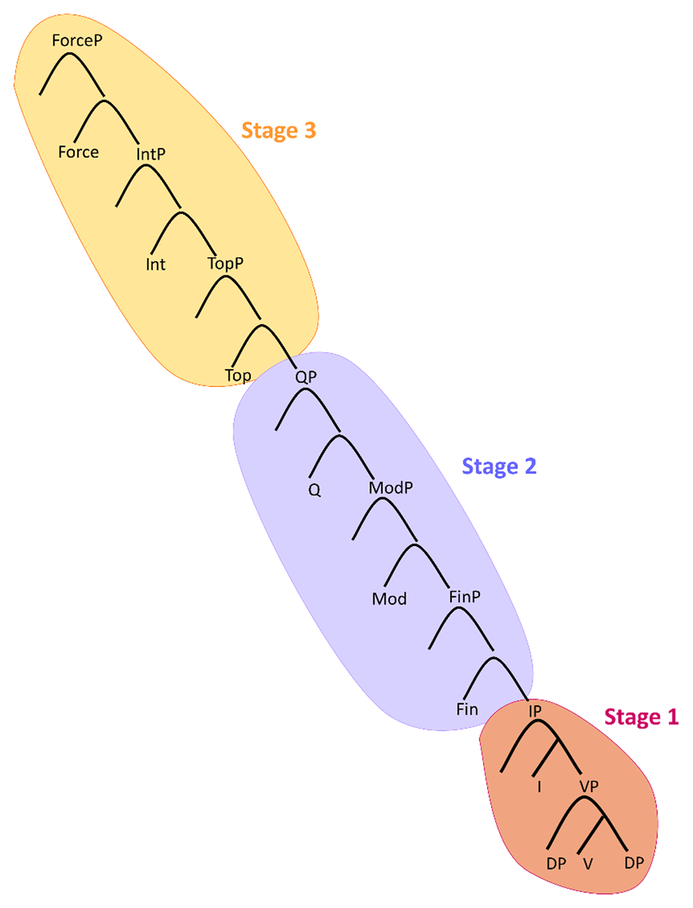

## 12. What is knowledge about language?

Explanations and visualisations 
> - Crash Course Linguistics [#1](https://youtu.be/3yLXNzDUH58), [#14](https://youtu.be/Nxyo83cQjhI) 
> - L. Rizzi, Collège de France opening lecture, [Complexity of linguistic structures, simplicity of language mechanisms](https://www.college-de-france.fr/en/agenda/opening-lecture/complexity-of-linguistic-structures-simplicity-of-language-mechanisms/complexity-of-linguistic-structures-simplicity-of-language-mechanisms), 
> - S. Piantadosi, [Zipf’s word frequency law in natural language: A critical review and future directions](https://www.ncbi.nlm.nih.gov/pmc/articles/PMC4176592/)


&nbsp; 


&nbsp; 


### Most important theoretical problems

- Arbitrariness of the sign: there is no natural connection between a word and its meaning, 
    - but the [Bouba/kiki effect](https://en.wikipedia.org/wiki/Bouba/kiki_effect) shows some connection
    - what is the mapping between the meaning and the form? 
- Double articulation (duality of patterning): merging meaningless units into meaningful ones, merging meaningful units into higher-order meaningful units
    - sometimes only the latter regarded as language
    - relevant to the question of what are the smallest units of language  
    - relevant to the question of the form of language competence: is it just one operation (merge)? 
- Displacement: we can talk about things we don't see 
    - but it seems that we don't use this freedom all the time 
    - relevant to the question what knowledge can be extracted from texts
- Innateness: are we born with a specialised language faculty or it's all just general cognition? 
    - a famous puzzle: [Poverty of the stimulus](https://en.wikipedia.org/wiki/Poverty_of_the_stimulus)
    - distantly relevant to generalisation and universality of NLP models
    - related to universality 

&nbsp; 

### Theoretical syntax: how do we compose phrases?



*Source: [Growing trees: The acquisition of the left periphery](https://www.glossa-journal.org/article/id/5877/)*

- Lexicon (vocabulary) contains two kinds of units:
    - Content units (nouns, adjective, verbs) describe entities we can imagine, e.g. things, people, animals, events and their properties 
    - Function units (articles, determiners, auxiliaries, complementisers, tense, aspect, mood, conjunction, implication, negation) express relations between content units
- Elements of lexicon are terminal nodes in a syntactic tree, non-terminal nodes are categories 
- Basic syntactic operations: merge, move, search, externalisation
- Grammatical notions are composed of basic operations (e.g. the notion of a relative clause) 
- Merge is binary, recursive, it is not symmetric (the result of a merge is a non-terminal category of the type of one of the two merged elements), the order of merges is constant
- Animals might be able to merge, but not recursively
- Method: introspection, do we accept or not a string? E.g.: 
---
```
     On croit [ que Jean est parti à 17h ]             
     
     'We think that John left at 17h'

     
     Quand croit-on [ que Jean est parti <...> ] ?  
     
     'When do we think that John left?'      

     
     On se demande [ qui est parti à 17h ] 
     
     'We wonder who left at 17h'

     
     * Quand se demande-t-on [qui est parti <...> ] ? 
     
     * 'When do we wonder who left ?'    
```
---

&nbsp; 

### Information theory: text measures and quantitative laws

- Observations of strings, typically not relating to the theoretical questions 
- Shannon entropy and complexity: text as a sequence of outcomes of a stochastic process
- Zipf-Mandelbrot Law: the relation between word frequency and its frequency rank is universal
- Zipf's Law of Abbreviation: the length of a word is inversely proportional to its frequency 
- Menzerath-Altmann’s Law: the bigger the whole, the smaller the parts
- Uniform information density, constant information rate: tendency to keep the amount of information constant


&nbsp; 

### Grammar vs. linguistics 
 
- Grammar is what we study in school: rules of a single language
- Linguistics is about explaining why grammars are the way they are
  - What is common to all grammars? 
  - What kinds of rules may or may not exist? 
- Most of what is called "linguistics" is about grammars (not theoretical) 


&nbsp; 

### Linguistics vs. NLP

- Symbolic rule-based methods relied a lot on grammars
- Statistical methods used annotated texts, Penn Treebank was an example for many others, now Universal Dependencies 
- Both rules and annotations are slightly formalised grammars, not scientific theory 
- LLMs and self-supervised learning often work without any explicit linguistic knowledge 
- Popular question: is there still any room for linguistics in NLP?


--------------

