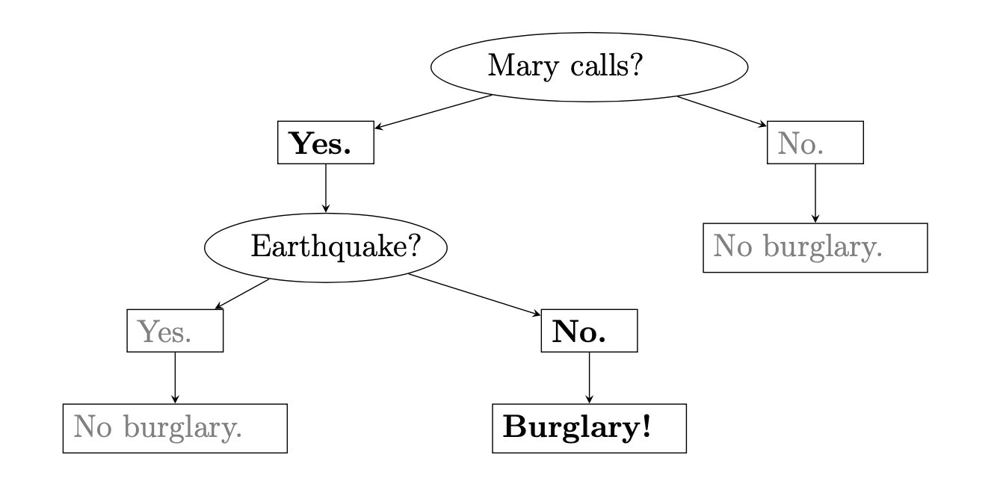
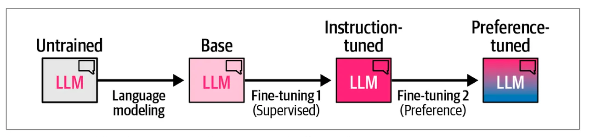

## 14. Reasoning in humans and in large language models 

> Explanations and visualisations: 

> - Jurafsky-Martin [9](https://web.stanford.edu/~jurafsky/slp3/9.pdf)
> - Jay Alammar's blog: [The Illustrated DeepSeek-R1](https://newsletter.languagemodels.co/p/the-illustrated-deepseek-r1)
> - [The Stanford Natural Language Inference (SNLI) Corpus](https://nlp.stanford.edu/projects/snli/) 
> - Amy Perfors, Joshua B. Tenenbaum,  Thomas L. Griffiths, Fei Xu: [A tutorial introduction to Bayesian models of cognitive development](https://doi.org/10.1016/j.cognition.2010.11.015) 
 

*Source (https://archive-ouverte.unige.ch/unige:38422)*

&nbsp; 

### Common sense reasoning 

The goal of reasoning is to establish the **truth value** or the **intent** of a **statement**. Real events can also be seen as statements since they are processed by our cognitive system to be mapped to abstract internal representation. 

Common sense reasoning is intertwined with language, but the relation is non-trivial. For example, the following single sentence, as an element of natural language, contains two statements. 

Sentence:

    Mary has a red car.

Statements:

   - Mary has a car
   - The car is red

A statements is a structure consisting of at least one entity and one relation.  

Entities:
- Mary 
- car

Relations:
- has
- red

To test common sense reasoning, we often ask questions. When chatGPT was released as the first general-purpose conversation agent, users tested its reasoning capacities by asking:

    What weights more, 1kg of feather or 1kg of iron?

In early versions, the system was returning the answer that 1kg if iron weights more, clearly not being able to take into account that the quantifier (1kg) should override the common knowledge that, if we manipulate approximately the same volume of feather and iron, iron would be much heavier. Interestingly, this is something that many humans would do as well. 

In the meantime, the models have improved, but they are still easily tricked. For example:  

    Q: if my friend has three cars, does she have two cars?
    A: Yes. If your friend has three cars, then she does have two cars, because having three 
       necessarily includes having at least two (and one more).

But: 

    Q: Does a four-legged animal have three legs?
    A: No — a four-legged animal does not have three legs.

Here is a little more sophisticated example:

    Q: When Winston entered the room, the clock was ticking. Was the clock in the room?
    A: Short answer: Not necessarily — but usually implied.

Some time ago, the answer to this prompt used to be straight YES, but now it seems more correct. In reality, we do not know where the clock was from this context alone. Many humans would respond YES too.  

But:

    Q: When Winston entered the room he saw the door was locked. Was Winston locked in?
    A: If he had already entered before it was locked, he might be locked in.
       If he saw it from outside or it was locked after he entered, he might not be locked in.
 

#### Communicative intents

Most of the reasoning is about establishing what is true, but this is not all. Humans apply reasoning for establishing and maintaining communication as well. For this, we use special form of sentences: 

- Questions
- Orders (instructions) 

We understand questions and instructions as prompts to act instead of evaluating their truth values. 

Moreover, we also recognise implicit communicative intents. For example, if we see a paper pasted on a wall, we will understand that there is a message for us. This understanding is the result of reasoning that we perform automatically and constantly. 

#### Formal logic

We can say that formal logic differs form common sense reasoning in a similar way that formal languages differ from natural language. It is a system devised to establish explicit rules of reasoning: what conclusions can be drawn from what premises. The goal is to describe valid logical forms disregarding the empirical truth of the statements.

&nbsp; 

### Reasoning under uncertainty

Most of the time, reasoning requires assessing the probability that some statements is true. Consider the following example from Perfors et al.:

    Imagine you see your friend Sally coughing. What could explain this? One possibility 
    (call it h(cold)) is that Sally has a cold; another (call it h(cancer)) is that she has 
    lung cancer; and yet another (call it h(heartburn)) is that she has heartburn. Intuitively, 
    in most contexts, h(cold) seems by far the most probable, and may even be the only one that 
    comes to mind consciously. Why? The likelihood favors h(cold) and h(cancer) over h(heartburn) 
    since colds and lung cancer cause coughing, while heartburn does not. The prior, however, 
    favors h(cold) and h(heartburn) over h(cancer): lung cancer is thankfully rare, while colds 
    and heartburn are common. Thus the posterior probability – the product of these two terms 
    – is high only for h(cold).

The term `prior` comes from the paradigm known as **Bayesian reasoning** in which we estimate the probability of a hypothesis given an observation (also called `data` and `evidence`). This estimation can be expressed as conditional probability (also called `posterior`). Its form in our example looks like this:

    p(cold|coughing) = (p(coughing|cold) x p(cold)) / p(coughing) 

And its general form is:

    P(A|B) = (P(B|A) x P(A)) / P(B) 

Since coughing is observed, its probability becomes irrelevant, so we are left with `p(cold|coughing) = p(coughing|cold) x p(cold)`. For drawing the conclusion that our friend has a cold, both probabilities in the equation need to be high. In this way, we introduce probability into assessing the truth of a statement. 

This reasoning is the basis of one of the most popular machine learning algorithms: **Naive Bayes** classifier. Applying the same logic, the algorithm is assessing the probability of a label (hypothesis) given the input (data).    

In cognitive science, Bayesian reasoning is often considered to be a computational model of how humans learn from evidence. This model is **hierarchical**, which means that our prior beliefs originate in more abstract knowledge. For example, our estimation of p(cold) might come not only from how many times we saw a cold but also from our general knowledge that humans can have this condition (while some other entities cannot). Once our conclusion about a particular case is validated, we update the more abstract knowledge too. 

&nbsp; 

### Thinking fast and slow

Based on the book *Thinking, Fast and Slow* by  Daniel Kahneman.

This book shows quite convincingly that humans have two modes of thinking. 

Fast: 
- efficient
- automatic  
- approximate (prejudices)
- susceptible to cognitive illusions (e.g. seeing causality in random events)

Slow:
- takes longer
- analytic 
- precise
- voluntary search for a solution

The following example shows a simple calculation that almost all people are able to perform:  

    A bat and a ball cost $1.10 in total. The bat costs $1.00 more than the ball.
    How much does the ball cost? _____ cents

Yet, a great majority of people will first give the same wrong answer (10 cents), and only come up with the correct answer (5 cents)  if they are asked to think more carefully. 

This shows that we tend to be in the fast thinking mode by default, but we are able to switch to slow thinking in some circumstances. 

Due to this, we often make mistakes in reasoning:  

- We are more sensitive to irrelevant stimuli than we think, For example, judges are shown to pronounce higher fines when exposed to higher numbers before the sentence. 
- We will pay more in insurance than really necessary because we want to avoid taking risk. 
- Coming back to our example from above, we might overestimate the probability that our friend has cancer if we recently learned of such a case. 

&nbsp; 

### Teaching LLMs to reason

*Source (https://newsletter.languagemodels.co/p/the-illustrated-deepseek-r)*

&nbsp; 

For now, the only way we can enrich LLMs with some reasoning skills is to give them long chains of human reasoning as examples (in the form of text data) and train them to imitate human behaviour in this way. The models are not able to generate and test hypotheses, they are currently designed to memorise and compress the observed data. When prompted, they act automatically following the learned patterns, similar to any other programmed machine, just with much more variation in the responses to the input.   

To be able to act when prompted, models need to see a lot of examples of prompts and learn to act from the example responses to the prompts. While we might experience these learnt responses as reasoning, models are simply generating the next token given the history, just like they were doing during pre-training. Continued training on pairs question - answer and instruction - acting is called **instruction tuning**.  

**Preference alignment** is another kind of additional training in which models learn what kind of behaviour is good and what is not. This is a separate model trained using reinforcement learning techniques (learning from rewards instead from mistakes) and then combined with the main model to give a joint output.  

#### Test-time induction

It has been observed recently that models can improve their answers without updating weights. This can be achieved in two ways:

- **Chain of thought** prompting is a way of obtaining complex explanations from the model by including the first steps of the target response in the prompt. This practice started as a request to perform the task *step-by-step*, which turned out helpful for improving the answers.
- **In-context learning** is a way of obtaining better response by giving several examples of input-output pairs within the prompt. Receiving these examples as a prefix, models return a more correct output for a new similar input than what they would do without seeing the examples. This is curious behaviour since nothing inside of the model is changed by the examples (the model is not tuned), but the target output still improves. The term *in-context learning* is misleading because there is no learning in fact, but users experience this behaviour as if the model learned from the examples. 

