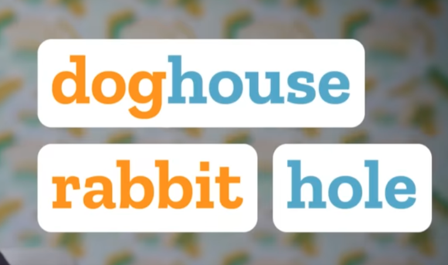
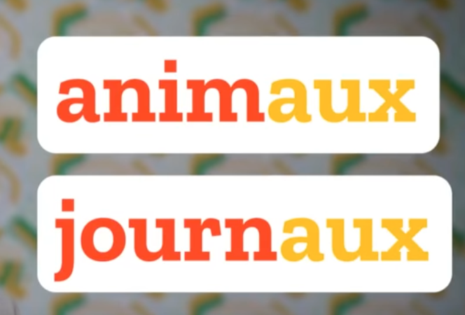
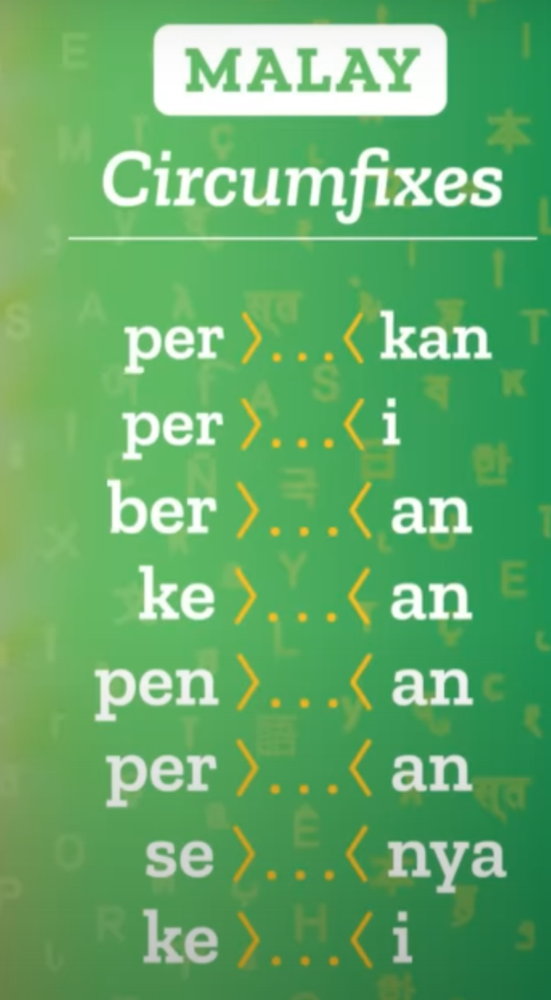
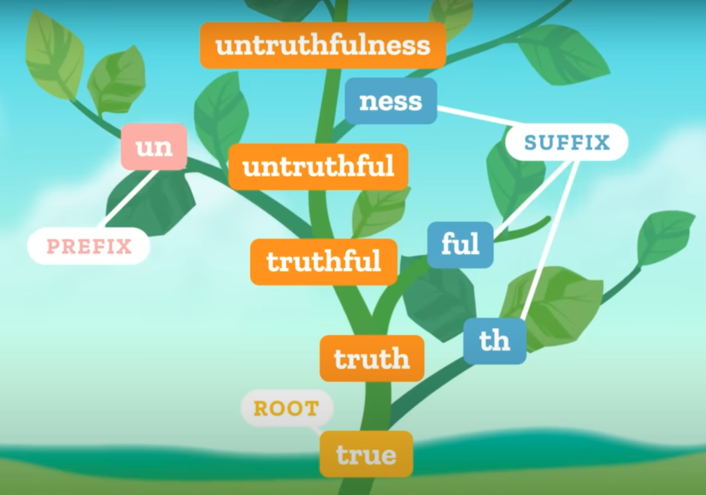
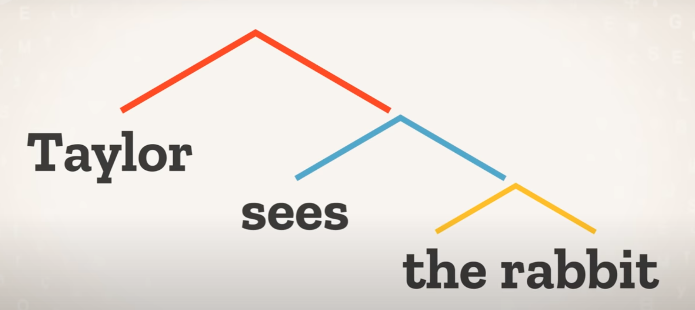
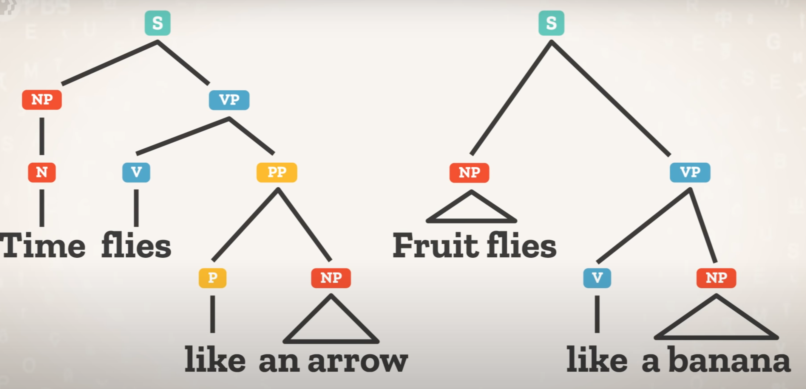

## 2. NLP tasks, data sets, benchmarks

> Explanations and visualisations 
> - Crash Course Linguistics [#2](https://youtu.be/93sK4jTGrss?si=iBXbRHv_6npQduCH), [#3](https://youtu.be/B1r1grQiLdk?si=parMqegmCgLtmCWH), [#4](https://youtu.be/n1zpnN-6pZQ?si=IbWeV913ioUzcwG5)
> - Universal Dependencies, [CoNLL-U format](https://universaldependencies.org/format.html)
> - Jurafsky-Martin [2.4](https://web.stanford.edu/~jurafsky/slp3/2.pdf) 
> - Lena Voita: [Text classification](https://lena-voita.github.io/nlp_course/text_classification.html#dataset_examples)

&nbsp; 

### Text parsing 

Because language is compositional, text parsing is performed at several levels. 

#### Tokenisation 

Here we decide what the units of processing are. In the CoNLL-like formats, tokenisation is deciding what goes in each row. Traditionally, each word is considered to be one token. But what is a word? What about punctuation?

&nbsp; 

Commonly mentioned levels:

- Word (also called pre-tokenisation)
- Subword 
- Character 
- Byte

#### Lemmatisation

Mapping different word forms into a single canonical form, e.g. journaux -> journal. It can be very difficult for some languages due to:

- non-concatenative morphology
- not clear difference between derivation and morphology 
- no clear word boundaries (e.g. Chinese) 

Morphology

Derivation

&nbsp; 

#### Part-of-speech (PoS) tagging or morphosyntactic definition (MSD)

Classifying tokens into categories, e.g. VERB, NOUN. If a language has rich morphology (like Latin), we need additional features called morphosyntactic definitions, e.g. NOUN in the ACCUSATIVE case SINGULAR, MASCULINE gender

&nbsp; 

#### Syntactic parsing 

How tokens combine into phrases and sentences:

No labels

&nbsp; 

Constituent analysis

&nbsp; 

Dependency analysis

&nbsp; 

### End-user tasks

- [Machine translation](https://machinetranslate.org/apis) 

- Examples in the [HuggingFace tutorial](https://huggingface.co/course/chapter1/3?fw=pt): 
    - sentiment analysis: given a short text, is it positive or negative?
    - named entity recognition: given a token, is it an ordinary word or does it refer to a specific real entity?
    - question answering: given a question and a text snippet, what segments of the text respond to the question? 
    - mask filling: given a sentence with empty slots, what tokens suit best the empty slots?  
    - summarisation 
    - text generation

- Famous (old) NLU benchmarks and data sets:
    - [GLUE](https://gluebenchmark.com/tasks)
    - [SQuAD](https://rajpurkar.github.io/SQuAD-explorer/)
    - [SNLI](https://nlp.stanford.edu/projects/snli/)

--------------

&nbsp; 

