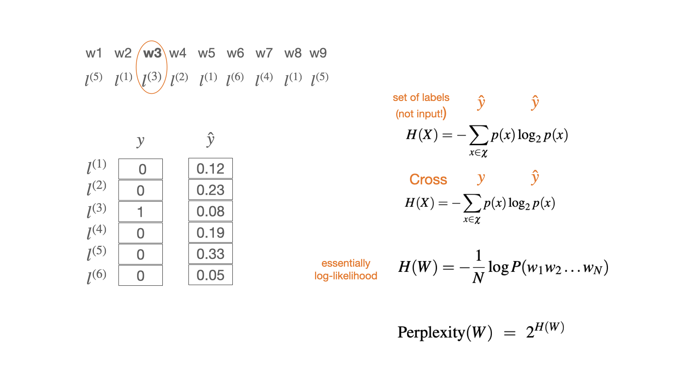

## 3. Evaluation, data splits 
 

> Explanations and formulas: 
> - Eisenstein 3.2.3, 4.4 (ignore significance), 6.4.2
> - Jurafsky-Martin 3.7, 4.6, 15.6 

&nbsp; 

### 1. Data splits

&nbsp; 

&nbsp; 

### 2. Comparing two sets of labels (confusion matrix)  

- This evaluation is common in machine learning in general
- Measures: precision, recall, F-score, accuracy
- All except accuracy are calculated on binary decisions per label and need to be averaged 
- In NLP, we use this kind of evaluation for tasks where we have a single label for a whole sentence, e.g. sentient analysis, similarity, inference, text classification 

&nbsp; 

### 3. Comparing two sequences of labels 

We have to take into account the order of the labels. The true sequence of labels is called reference.

Measures: 
-  **WER** mostly in speech to text conversion
-  **BLEU** mostly in machine translation 
-  **chrF** starting to be used more than BLEU in machine translation

&nbsp; 

### 4. Comparing a sequence of labels to a model 

We can evaluate a sequence against a model. For this, we rely on **information theory**, specifically:

- Entropy 
- Cross-entropy
- Perplexity 

These quantities are used as measures of the quality of generated text, but also (and much more!) as loss functions in training.

&nbsp; 

E.g. high vs. low entropy:  

&nbsp; 

Example: log likelihood, cross-entropy, perplexity  

In this example, we assume that our sequence of words is of the length 9 (as a sentence consisting of 9 words). Our toy vocabulary has 6 members (all sentences in our toy language are made up of these 6 words). Since we are predicting words, each member of the vocabulary is a label, so we can say that we have 6 possible labels. 

At each of the positions in the sentence (1-9), we have the output of the model, which is the probability distribution over all labels. This is what we call the model prediction (*y-hat*). This distribution will be different in each position. We are currently in the position 3 and, for this position, the model has outputted the probability *y-hat* shown above. In this position a particular word is found in the training data. The identity of this word is given by the 1-hot true distribution *y*, where only one label (the word that actually appeared in the training data) has the probability 1 and the probability of all the other labels is 0. 

The cross-entropy score for this single evaluation is similar to a dot product between the vectors *y* and *y-hat*: we multiply each cell of *y* with the log of the corresponding *y-hat* cell and then sum all these products. Since only one cell in *y* is not 0 the whole sum will be equal to the product of that cell with its corresponding *y-hat* cell, that is to the log of the corresponding *y-hat* probability. Because we change the sign of this value (note the negative sign in the formula), the smaller the probability the higher the cross-entropy value. In this case, the cross-entropy is high because the predicted probability of the label that actually occurred is low. 

&nbsp; 

### 5. Loss vs. performance 

All these comparisons give us a measure of error of our model, that is how well our model predicts the real (true) events that we are modelling. We measure the error in different contexts for different purposes. 

1. On the **train** set -> **loss**, training error for setting **model parameters (weights)**  
2. On the **dev** set  -> no standard term, but can be thought as *interim performance*, sometimes called *validation*, error measured for setting **hyperparameters**, e.g. the weight of a component in a processing pipeline, learning rate for weight updating, training duration etc. 
3. On the **test** set -> **performance**, importantly, an **estimate** of the performance!

Only the last point is evaluation. 
 
Cross-entropy is typically used as a loss, while perplexity as the performance measure on the test set. 

&nbsp; 

### 6. The baseline 

When evaluating a NLP system, we want to know whether it performs **better than another system**. There is no point in reporting scores without a comparison. If no other system exists, then we compare our system to a simple solution, which does not involve learning. This simple solution is called the **baseline**. An example of such a simple solution is the *majority class baseline* -- putting all test items in a single class, the one that is most frequently seen in the training set. 

&nbsp; 

### Common mistakes in evaluation  

- "I get 78% accuracy - not bad!" >> not bad compared to what?!
- "My system is not so good on the dev set, but it nails it on the test!" >> your system got lucky with the test set 
- "I'm happy with the accuracy, but I don't like the F-score (so I'm not going to report it)" >> there is probably one frequent label that your system gets well, but not the others   

--------------

&nbsp; 