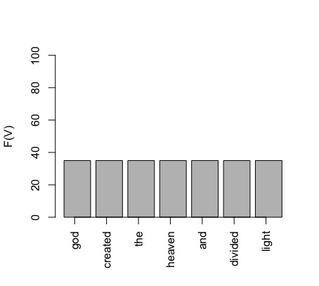
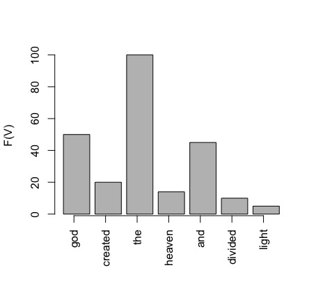

## 3. Evaluation, data splits 

> Explanations and formulas: 
> - Eisenstein 2.4 (ignore Naive Bayes), 3.2.3, 4.4 (ignore significance), 4.5, 6.4.2
> - Jurafsky-Martin 4.7, 16.5 

&nbsp; 

### Two main kinds of evaluation in NLP 

&nbsp; 

#### 1. Label comparison in a confusion matrix  

&nbsp; 

- This evaluation is common in machine learning in general
- Measures: precision, recall, F-score, accuracy
- All except accuracy are calculated on binary decisions per label and need to be averaged 
- In NLP, we use this kind of evaluation for tasks where we have a single label for a whole sentence, e.g. sentient analysis, similarity, inference, text classification 

&nbsp; 

#### 2. Comparing sequences

Comparing a sequence to a model expectation: 

Measures log likelihood, perplexity, cross-entropy, used for evaluation in text generation and as loss functions. 

&nbsp; 

Comparing a sequence to another sequence:

Measures: WER, BLEU, chrF, used for machine translation, speech to text conversion, summarisation.   

&nbsp; 

### Three points where we measure the error

1. On the **train** set -> **loss**, training error for setting **model parameters (weights)**  
2. On the **dev** set  -> no standard term, but can be thought as *interim performance*, sometimes called *validation*, error measured for setting **hyperparameters**, e.g. the weight of a component in a processing pipeline, learning rate for weight updating, training duration etc. 
3. On the **test** set -> **performance**, importantly, an **estimate** of the performance!

Only the last point is evaluation. 

&nbsp; 

### The baseline 

When evaluating a NLP system, we want to know whether it performs **better than another system**. There is no point in reporting scores without a comparison. If no other system exists, then we compare our system to a simple solution, which does not involve learning. This simple solution is called the **baseline**. An example of such a simple solution is the *majority class baseline* -- putting all test items in a single class, the one that is most frequently seen in the training set. 

&nbsp; 

### Common mistakes in evaluation  

- "I get 78% accuracy - not bad!" >> not bad compared to what?!
- "My system is not so good on the dev set, but it nails it on the test!" >> your system got lucky with the test set 
- "I'm happy with the accuracy, but I don't like the F-score (so I'm not going to report it)" >> there is probably one frequent label that your system gets well, but not the others   

--------------

&nbsp; 