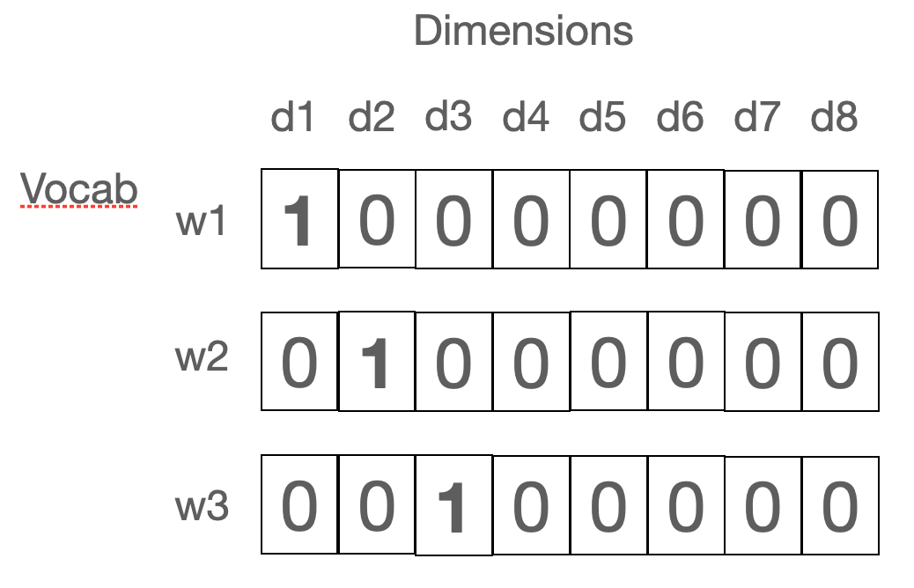
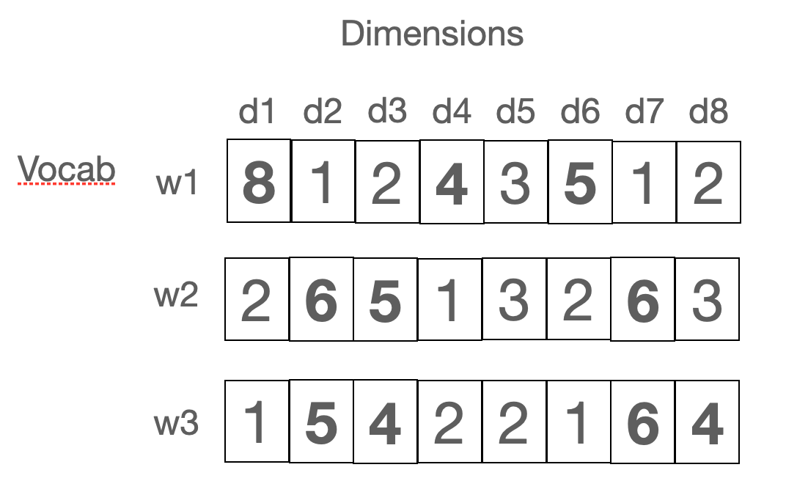
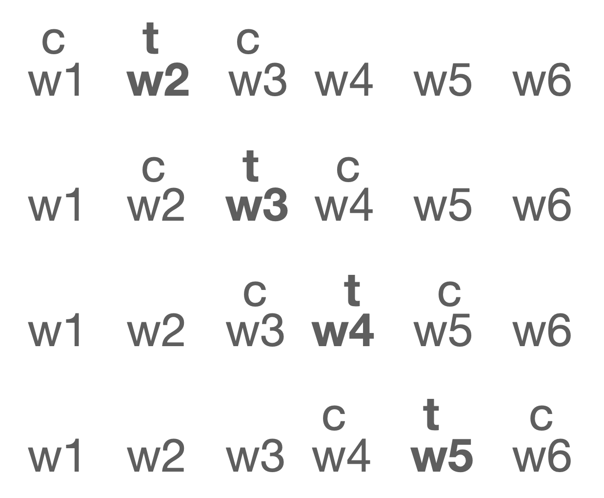

## 4  Representing the meaning of words with word2vec

> Explanations, visualisations and formulas: 
> - Jurafsky-Martin [6](https://web.stanford.edu/~jurafsky/slp3/6.pdf) 
> - Lena Voita: [Word embeddings](https://lena-voita.github.io/nlp_course/word_embeddings.html)
> - Jay Alammar: [The Illustrated Word2vec](http://jalammar.github.io/illustrated-word2vec/)
> - Xin Rong: [word2vec Parameter Learning Explained](https://arxiv.org/pdf/1411.2738.pdf) 

&nbsp; 

### Word identity: one-hot encoding 

In one-hod encodings no meaning is represented: all words are equally distant from each other, each word is one dimension in a high-dimensional space, each orthogonal to each 

&nbsp; 

### Word embedding: a continuous representation 

When we embed a word in a space, each word is a data point in the space, the number of dimensions can be lower as we don't need one dimension per word. When embedded, words with similar meanings will be positioned close to each other in the embedding space. 

&nbsp; 

### Target vs. context words 

We regard all words that appear in a text from two sides. On one side, each word carries its own distinct meaning, which we want to represent. When we look at the words from this side, we call them *target*. On the other side, each word is also a feature or a component of the meaning of other words. When a word describes other words, we call it *context*. What role a word has depends on where we are currently looking.

**Important**: Each word has a target and a context representation. 

&nbsp;

### word2vec training objectives 

- cbow: *p(t|c)*
- skip-gram: *p(c|t)*

word2vec is a neural language model.  

**Important**: The set of labels is huge: each word is a label!

&nbsp;

### word2vec trick 1

*p(t|c)* and *p(c|t)* are estimated with a neural network. For a neural network to predict a word, it has to have representations of both the input and the output. These representations are the meanings of words! 

&nbsp;

### word2vec trick 2

In the skip-gram version, we replace the objective *p(c|t)* with *p(yes|t.c)*. So, instead of predicting the word, we just decide whether the target-context relation holds between two words. We go from thousands of labels to only 2. But for this to work, we need examples for both cases *yes* and *no*. We get *yeses* from the training text and we randomly sample *nos*.

