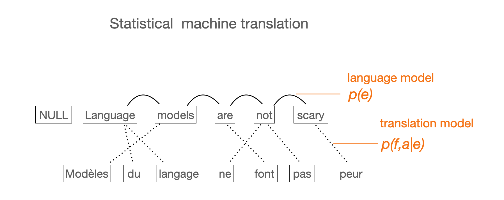
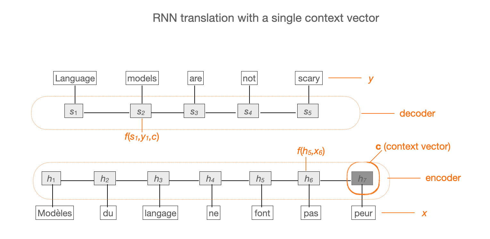
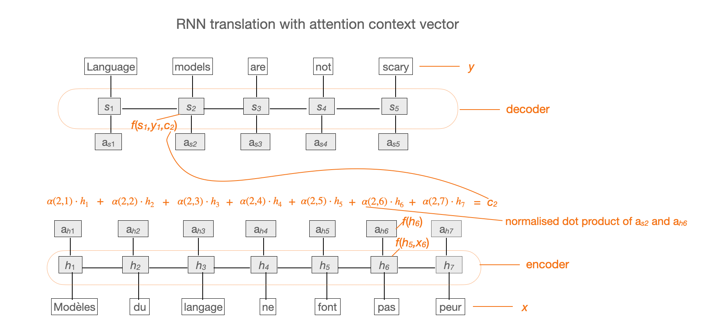
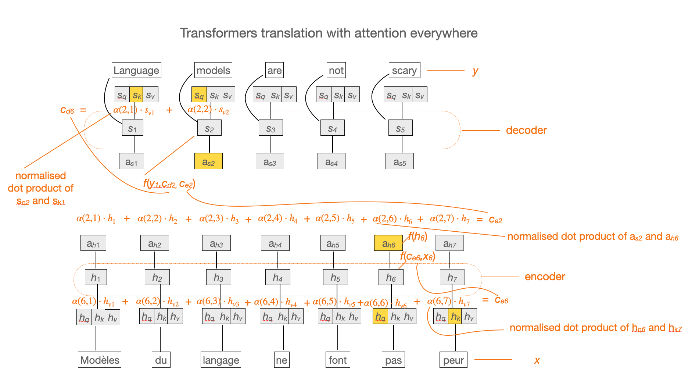

## 7. Attention in language modelling 

> Explanations, formulas, visualisations: 
> -  Jay Alammar's blog: [The Illustrated Transformer](http://jalammar.github.io/illustrated-transformer/)
> -  Jurafsky-Martin [10](https://web.stanford.edu/~jurafsky/slp3/10.pdf)
> -  Lena Voita's blog: [Sequence to Sequence (seq2seq) and Attention](https://lena-voita.github.io/nlp_course/seq2seq_and_attention.html)
> - Bahdanau et al. 2014: [Original paper](https://arxiv.org/pdf/1409.0473.pdf)

&nbsp; 

### 1. Attention in psychology 

Spotlight metaphor

&nbsp; 

We are aware of only a small portion of the perceived stimuli. Attention is our ability to select the most relevant stimuli from our surrounding and bring them to our awareness. 

&nbsp; 

### 2. How it started in machine translation: alignment (not attention)

&nbsp; 

In statistical machine translation, we combine two models: translation model (*p*(*f*,*a*\|*e*), dotted lines) and language model (*p*(*e*), arcs). The parameters of the models are probabilities, word pairs in the translation model and n-grams in the language model. These probabilities are estimated from the training corpora with the maximum likelihood estimation. Since we don't have aligned words in the training data (only aligned sentences), we use the expectation-maximisation algorithm (EM) to estimate the parameters. Learning all the parameters from the data corresponds to encoding. When decoding, we search for the sequence in the target language that maximises the log probability (over the whole sequence) taking into account both the translation and the language model.

&nbsp; 

### 3. Encoder-decoder machine translation  without attention (RNNs)

&nbsp; 

In neural MT, we do not estimate probabilities directly, but we learn hidden representations (hidden states) in several steps. The first neural systems consisted of two RRNs, one for the encoding step and the other for the decoding. In the first solutions, there are not direct dependences at the word level. The last state of the encoder is considered to contain all the information about the source sentence and target sentence is generated conditioning on this information: every hidden state of the decoder gets the same context vector as input. 

&nbsp; 

### 4. Encoder-decoder machine translation with attention (soft alignment)

&nbsp; 

The attention mechanism was introduced to the encoder-decoder framework to allow more direct modelling of the word-level dependencies. For this, we create additional hidden states one for each encoder and one for each decoder state. We calculate the attention between these states and we use the attention vector as the context vector. In this way, each decoder state obtains a different context vector. This context vector can be seen as a soft version of the word alignment. It is a weighted sum over all encoder hidden states such that most of the information in this sum comes from the states that are the most relevant to the given decoder state.  

&nbsp; 

### 5. How it's going: attention everywhere (Transformers) 

&nbsp; 

In the Transformers architecture, the recurrence component of RNNs is replaced by **self-attention**, keeping the encoder-decoder attention as well. For this, we split each encoder state into three special states for calculating attention. These are the Q, K, V components. The same is done on the decoder side, just that the decoder self-attention has a time constraint: the decoder is allowed to look only to the states that precede the current state. The encoder-decoder attention works in the same way as before.   

--------------
