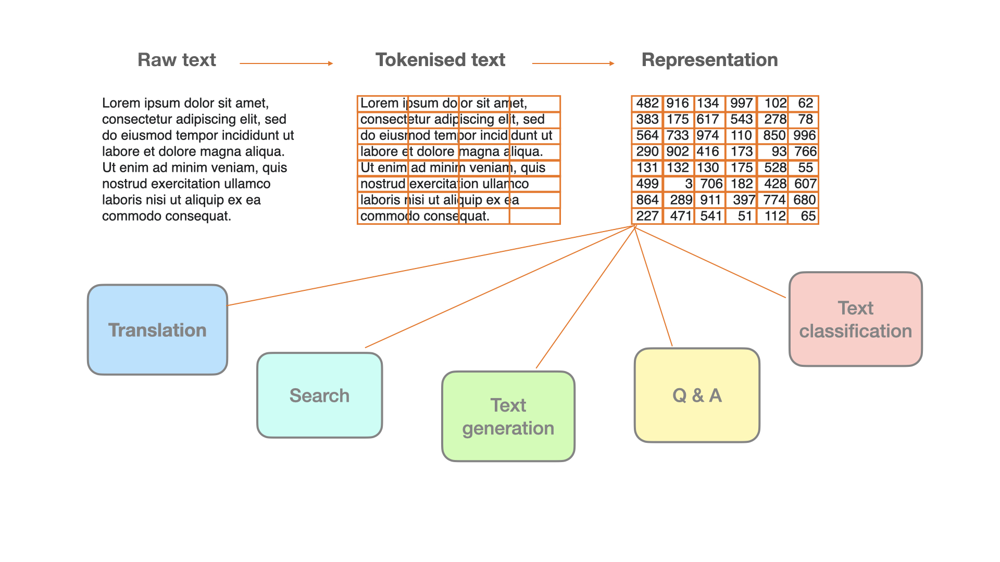
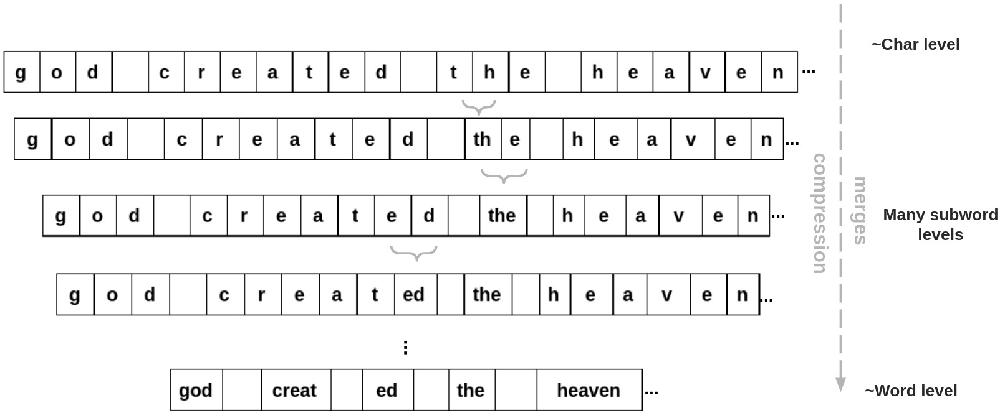

## 8. Subword tokenization 

> Explanations and visualisations: 
> - Jurafsky-Martin [2.3](https://web.stanford.edu/~jurafsky/slp3/2.pdf)
> - Andrej Karpathy, Let's build the GPT Tokenizer [YouTube video](https://www.youtube.com/watch?v=zduSFxRajkE&t=2s)
> - Hugging Face [Tokenizers library](https://huggingface.co/course/chapter6/1?fw=pt)
> - [Tiktokenizer](https://tiktokenizer.vercel.app)

&nbsp; 

### Why is text segmentation not trivial?

Source: [Khan Academuy](https://www.khanacademy.org/computing/computers-and-internet/khan-academy-and-codeorg-binary-data)

&nbsp; 

- Text is segmented into tokens (compared to frames in sound processing, pixels in image processing)
- How should we split texts into tokens? 
- Word as a token: too naive, overestimating the size of the vocabulary
    - *fast* and *faster* equally distinct as *fast* and *water* 
    - what is a word? 
    - much less clear in languages other than English  

&nbsp; 

### The problem of out-of-vocabulary (OOV) words

- Follows from Zipf's law: most of words are rare
- Follows from information theory: rare words are long
- Subword tokenization as a solution: split words into smaller segments
- New problem: How to split words? What should be subword units? 
- One possibility: linguistic morphology 
- Other possibilities: substrings that are not necessarily linguistic units: subword tokens 

&nbsp; 

### Compression algorithms  

&nbsp; 

- Byte-Pair Encoding (BPE)
    - Starts with Unicode characters as symbols and pre-tokenization (word-level)
    - Iterates over data, in each iteration creates one new symbol
    - Each new symbol is introduced as a replacement for the most frequent bigram of symbols  
- WordPiece
    - Starts with Unicode characters as symbols and pre-tokenization (word-level)
    - Iterates over data, in each iteration creates one new symbol
    - Each new symbol is introduced as a replacement for the bigram of symbols with the highest association score (similar to mutual information)     

&nbsp; 

### Probability models 

- Start with all possible splits in theory, in practice, from a sample of all possible splits
- Eliminate symbols that contribute least to increasing the log probability of the data 
- Morfessor 
    - More popular in earlier work on morphological segmentation 
    - Can be tuned to put more weight on minimising either vocabulary or data size 
- Unigram model 
    - Currently very popular 
    - Vocabulary size an explicit hyper-parameter 

 
&nbsp; 

### The trade-off between data (=text) size and vocabulary size 

- Following from information theory: the shorter the symbol the more re-occurrence 
- If there are regular patterns, they will re-occur, in this sense structure is recurrence
- If symbols are short and re-occurring -> small vocabulary, more evidence for estimating probability, but data longer
- If symbols are long -> big vocabulary, little evidence for estimating probability, but data shorter   
- The goal of subword segmentation: find the optimal symbols minimising both sizes (data and vocabulary) 

 
&nbsp; 

### Practical tips

- BPE good for consistent, more regular data
- Unigram better for noisy data
- WordPiece merges more lexical items (roots) 
- Vocabulary size often decided as a function of the data size, sometimes as a proportion of the word-level vocabulary 
- BPE and Unigram implemented in the SentencePiece library 
- WordPiece used for BERT 
 
--------------

&nbsp; 
