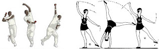
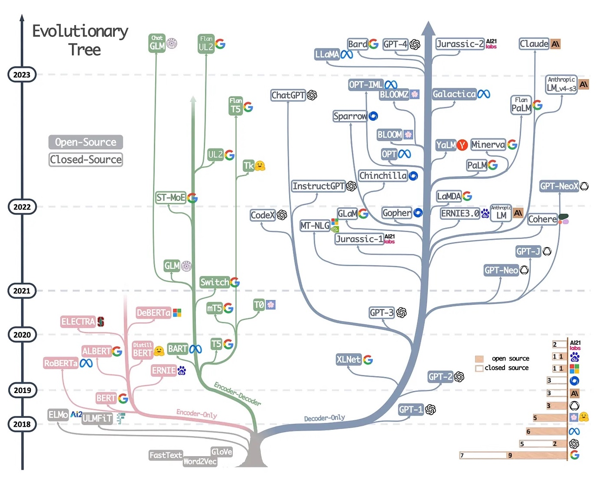

## 9. Transfer learning: Performing tasks with encoder-type pre-trained models

> Explanations and visualisations: 
> - Jurafsky-Martin [10](https://web.stanford.edu/~jurafsky/slp3/10.pdf)
> - Lena Voita's blog: [Transfer Learning](https://lena-voita.github.io/nlp_course/transfer_learning.html)
> - Jay Alammar's blog: [A Visual Guide to Using BERT for the First Time](http://jalammar.github.io/a-visual-guide-to-using-bert-for-the-first-time/)

&nbsp; 

*Source: http://transfersoflearning.blogspot.com/2010/03/positive-transfer.html*

&nbsp; 

### Before Large Language Models (LLMs) 

- We shared **trained** models which were strictly task-specific 
- Models could be trained with **joint** or **multi-task** learning: find the parameters that minimise two losses, e.g. PoS and lemma   
- Neural networks could be designed with **parameter sharing**: some parts of the network are shared between two tasks (their loss combined used for weight updating) and other parts are task specific (using only one loss to update the weights)

&nbsp; 

### With LLMs

&nbsp; 

- Consecutive transfer: first **pre-train** a LLM, then the **train** the main model with LLM as input  
- A LLM is trained on raw text with **self-supervised** learning  
- The main model is trained on labelled data (most of the time) with **supervised learning**
- The way how pass the pre-trained weights depends on whether the task is **token** or **sentence** level

&nbsp; 

### Options for how to use LLMs 

- **Fine-tuning**: This term is typically used in cases where the learning objective (task) used for pre-training LLM is different from the objective (task) on which the main model is trained. For example, a typical task for pre-training LLMs is masked language modelling (MLM), while the main model is trained for text classification or sentiment analysis. All weights are updated with the main model's loss. 
- **Continued training**: This term is used in cases where a pre-trained LLM is used to improve text representation on a new domain or a new language. In this case, the the learning objective is the same for the pre-trained LLM and the main LM (e.g. we use MLM in both cases), but pre-training and main training are done on different data sets. All weights are updated with the main model's loss.
- **One- and few-shot learning**, also known as meta-learning: pre-trained LLM performs the main task without updating parameters. A pre-trained LLM learns to classify new examples relying on a similarity function. This terminology is very new, not yet summarised in a textbook. An overview of terms and references can be found in [Timo Schick's PhD thesis](https://edoc.ub.uni-muenchen.de/29867/1/Schick_Timo.pdf)
- **Adaptation**: Pre-trained weights fixed, train only a small component to use the pre-trained weights for a new task
- **Zero-shot** classification: unsupervised setting without updating LMMs parameters. 

&nbsp; 

### LLMs model types

*Source: https://www.interconnects.ai/p/llm-development-paths*

&nbsp; 

- model architecture types:
   - only the encoder part of Transformers (e.g. BERT), used for **classification**, both toke-level and sentence-level
   - only the decoder part of Transformers (e.g. GPT), used for text **generation**, now known as *Generative AI*
   - full encoder-decoder Transformers (e.g. t5), used for machine translation, but also for generation.
- training objective:
  - masked language modelling (e.g. BERT, RoBERTa)
  - discriminating between alternative fillings of slots (e.g. ELECTRA)
  - reconstructing the input after permutations (e.g. XLNet)
- model size
  - several models are trained using fewer parameters (e.g. DistilBERT) 

&nbsp; 

### Encoder-type LLM examples:

- BERT (Bidirectional Encoder Representations from Transformers), info from J&M: 
    - An English-only subword vocabulary consisting of 30,000 tokens generated using the WordPiece algorithm
    - Input context window N=512 tokens, and model dimensionality d=768
    - L=12 layers of transformer blocks, each with A=12 (bidirectional) multihead attention layers
    - 100M parameters
- RoBERTa (A Robustly Optimized BERT Pretraining Approach), info from Hugging Face:
    - The details of the masking procedure for each sentence are the following:
    - 15% of the tokens are masked.
    - In 80% of the cases, the masked tokens are replaced by MASK.
    - In 10% of the cases, the masked tokens are replaced by a random token (different) from the one they replace
    - In the 10% remaining cases, the masked tokens are left as is
    - Contrary to BERT, the masking is done dynamically during pretraining (e.g., it changes at each epoch and is not fixed)
- XLM-RoBERTa, info from J&M:
    - A multilingual subword vocabulary with 250,000 tokens generated using the SentencePiece Unigram LM algorithm.
    - Input context window N=512 tokens, and model dimensionality d=1024.
    - L=24 layers of transformer blocks, with A=16 multihead attention layers each
    - 550M parameters
- ELECTRA, info from HuggingFace: 
    - ELECTRA modifies the pretraining objective of traditional masked language models like BERT. Instead of just masking tokens and asking the model to predict them, ELECTRA trains two models, a generator and a discriminator. The generator replaces some tokens with plausible alternatives and the discriminator (the model you’ll actually use) learns to detect which tokens are original and which were replaced. This training approach is very efficient and scales to larger models while using considerably less compute.

### LLMs source data and type

- English (Wikipedia and BooksCorpus):  bert-base, cased and uncased
- French: FlauBERT (BERT), CamemBERT (RoBERTa), variants
- Bosnian, Croatian, Montengrin, Serbian: BERTić (ELECTRA), trained on almost all the texts available online 
- many, many more!

--------------

&nbsp; 
