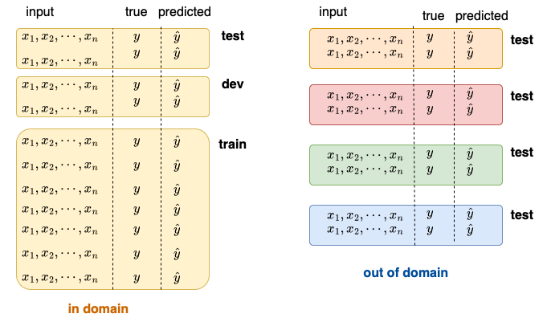
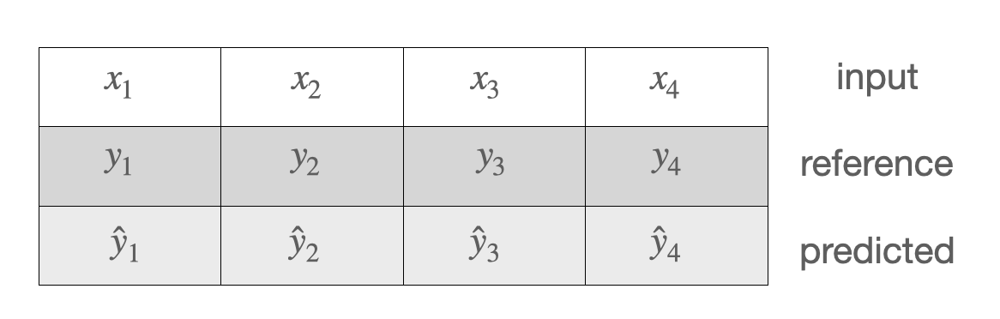

Tanja Samardžić, University of Geneva, Autmn 2022, Lecture notes

# Introduction to NLP   
# (Traitement automatique du langage naturel - TALN)  

&nbsp; 

Online textbooks:
- Dan Jurafsky and James H. Martin: [Speech and Language Processing (3rd ed. draft)](https://web.stanford.edu/~jurafsky/slp3/)
- Jacob Eisenstein: [Natural Language Processing](https://github.com/jacobeisenstein/gt-nlp-class/blob/master/notes/eisenstein-nlp-notes.pdf)
- Yoav Goldberg: [A Primer on Neural Network Models for Natural Language Processing](https://u.cs.biu.ac.il/~yogo/nnlp.pdf)
- Tom Mitchell: [Machine Learning](https://www.cs.cmu.edu/afs/cs.cmu.edu/user/mitchell/ftp/mlbook.html) - an old classics

Blogs and other learning resources:
- Lena Voita's [NLP course](https://lena-voita.github.io/nlp_course.html#main_page_content)
- Hugging Face [Course](https://huggingface.co/course/chapter1/1)
- [Jay Alammar's blog](http://jalammar.github.io)
- [Serrano Academy](https://serrano.academy) 
- YouTube channel [3blue1brown](https://www.youtube.com/c/3blue1brown)

&nbsp; 

&nbsp;

 **LECTURES** 

## 1. History of NLP, interdisciplinarity, current pipeline

&nbsp; 

### Three big eras in the history of NLP

&nbsp; 

### NLP at the intersection of three disciplines 

- Computational Linguistics is more about text **parsing**, NLP more about **end user** tasks. 
- Machine learning is a set of methods and techniques used to parse text and perform end-user tasks.
- End-user tasks are an important part of artificial intelligence because language is the most prominent capacity of human intelligence. 

(More explanations in Eisenstein)  

&nbsp; 

### Current pipeline

---

&nbsp; 

## 2. NLP tasks, data sets, benchmarks

&nbsp; 

### Text parsing 

- Parsing levels:
   - tokenisation
   - lemmatisation, normalisation
   - morphology, part-of-speech (PoS)
   - syntax (dependency today, previously constituency)
   - semantic roles 
   - coreference 
- Examples of parsing levels: [CoNLL-U format for Universal Dependencies](https://universaldependencies.org/format.html)
- Text parsing previously considered to be input to end-user tasks, but it's roles is not so clear today

&nbsp; 

### End-user tasks

- Examples in the [HuggingFace tutorial](https://huggingface.co/course/chapter1/3?fw=pt): 
    - sentiment analysis
    - text generation
    - mask filling
    - named entity recognition
    - question answering
    - summarisation 
    - translation
- Famous NLU benchmarks and data sets:
    - [GLUE](https://gluebenchmark.com/tasks)
    - [SQuAD](https://rajpurkar.github.io/SQuAD-explorer/)
    - [SNLI](https://nlp.stanford.edu/projects/snli/)
    - [COPA](https://people.ict.usc.edu/~gordon/copa.html)

--------------

&nbsp; 

## 3. Evaluation, data splits 

&nbsp; 
Explanations and formulas: 
- Eisenstein 2.4 (ignore Naive Bayes), 3.2.3, 4.4 (ignore significance), 4.5, 6.4.2
- Jurafsky-Martin 4.7, 26.5, 
&nbsp; 

&nbsp; 

### Two main kinds of evaluation in NLP 

&nbsp; 

1. Label comparison in a confusion matrix - usual setting in machine learning in general 

&nbsp; 

2. Comparing sequences - more specific to NLP, more complicated 

&nbsp; 

&nbsp; 

### Three points where we measure the error

1. On the **train** set -> **loss**, training error for setting **model parameters (weights)**  
2. On the **dev** set  -> no standard term, but can be thought as *interim performance*, sometimes called *validation*, error measured for setting **hyperparameters**, e.g. the weight of a component in a processing pipeline, learning rate for weight updating, training duration etc. 
3. On the **test** set -> **performance**, importantly, an **estimate** of the performance!

Only the last point is evaluation. 

&nbsp; 

### Two most frequent measures for loss

1. Maximum likelihood -> minimising negative log likelihood  
2. Cross-entropy  -> minimising conditional log likelihood

&nbsp; 

### Measures for performance estimation   

- For comparing single labels (confusion matrix)
    1. Precision
    2. Recall 
    3. F-score 
    4. Accuracy 

- For comparing sequences with a reference
    1. Error rate in speech-to-text 
    2. [BLEU](https://en.wikipedia.org/wiki/BLEU) in machine translation 
    3. [ROUGE](https://en.wikipedia.org/wiki/ROUGE_(metric)) in machine translation, text summarisation 

- For sequences without a reference (language modelling)
    1. Perplexity 

### The baseline 

When evaluating a NLP system, we want to know whether it performs **better than another system**. There is no point in reporting scores without a comparison. If no other system exists, then we compare our system to a simple solution, which does not involve learning. This simple solution is called the **baseline**. An example of such a simple solution is the *majority class baseline* -- putting all test items in a single class, the one that is most frequently seen in the training set. 

### Common mistakes in evaluation  

- "I get 78% accuracy - not bad!" >> not bad compared to what?!
- "My system is not so good on the dev set, but it nails it on the test!" >> your system got lucky with the test set 
- "I'm happy with the accuracy, but I don't like the F-score (so I'm not going to report it)" >> there is probably one frequent label that your system gets well, but not the others   

--------------

&nbsp; 

## 4. Text encoding with Transformers NNs 

&nbsp; 
Explanations, formulas, visualisations: 
-  Jay Alammar's blog: [The Illustrated Transformer](http://jalammar.github.io/illustrated-transformer/)
-  Lena Voita's blog:[Sequence to Sequence (seq2seq) and Attention] (https://lena-voita.github.io/nlp_course/seq2seq_and_attention.html)

&nbsp; 

### Better, "dynamic" (sub)word vectors 

- more information from the context 
- more nuanced representation 

### Generalised attention

- comes from encoder-decoder RNNs 
- generalised as self-attention 
- increases parallel computation, while keeping the context 

### Training with self-supervision 

- masked language modelling as a training goal
- comparing probability distributions as a loss function

### Subword tokenization

- Control over the size of the vocabulary
- Dealing with unknown words

### Implementation aspects

- multihead attention 
- positional encoding 
- stacked FFNNs encoders 

--------------

&nbsp; 

## 5. History of language modelling

--------------

&nbsp; 

## 6. History of NN architectures: LSTMS, CNNs 

--------------

&nbsp; 

## 7. Performing tasks with pretrained models

--------------

&nbsp; 

## 8. Multimodal processing (vision, speech) 

--------------

&nbsp; 

## 9. What is knowledge about language?

--------------

&nbsp; 

## 10. What linguistic knowledge is contained in LLMs

--------------

&nbsp; 

## 11. Multilingual NLP 

--------------

## Dates: 

| 29.09 &nbsp;  | 06.10  &nbsp; | 13.10 &nbsp; | 20.10 &nbsp; | 27.10 &nbsp; | 03.11 &nbsp; | 10.11 &nbsp; | 17.11 &nbsp; | 24.11 &nbsp; | 01.12 &nbsp; | 08.12 &nbsp; | 15.12 &nbsp; | 22.12 &nbsp;  | 
| ---- | ---- |  ---- |  ---- |  ---- |  ---- |  ---- |  ---- | ---- |  ---- |  ---- |  ---- | ---- |
| 1     | 2     |       3  | 4  | 5     |    6  |    7  |    8  |     9 |   10  |   |   11  |    | 

---

