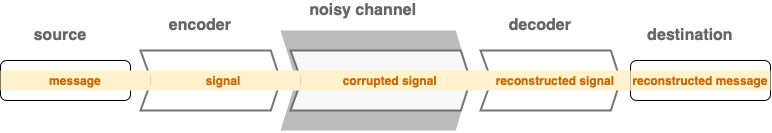
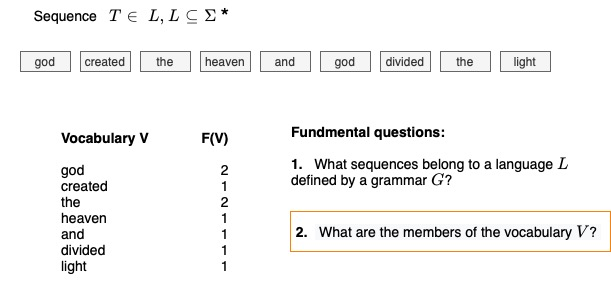
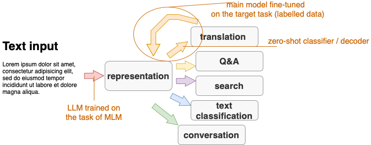

Tanja Samardžić, University of Geneva, Autmn 2022, Lecture notes

# Introduction to NLP   
# (Traitement automatique du langage naturel - TALN)  

&nbsp; 

> Online textbooks:
> - Dan Jurafsky and James H. Martin: [Speech and Language Processing (3rd ed. draft)](https://web.stanford.edu/~jurafsky/slp3/)
> - Jacob Eisenstein: [Natural Language Processing](https://github.com/jacobeisenstein/gt-nlp-class/blob/master/notes/eisenstein-nlp-notes.pdf)
> - Yoav Goldberg: [A Primer on Neural Network Models for Natural Language Processing](https://u.cs.biu.ac.il/~yogo/nnlp.pdf)
> - Tom Mitchell: [Machine Learning](https://www.cs.cmu.edu/afs/cs.cmu.edu/user/mitchell/ftp/mlbook.html) - an old classic
> 
> Blogs and other learning resources:
> - Lena Voita's [NLP course](https://lena-voita.github.io/nlp_course.html#main_page_content)
> - Hugging Face [Course](https://huggingface.co/course/chapter1/1)
> - [Jay Alammar's blog](http://jalammar.github.io)
> - [Serrano Academy](https://serrano.academy) 
> - YouTube channel [3blue1brown](https://www.youtube.com/c/3blue1brown)

&nbsp; 

&nbsp;

 **LECTURES** 

## 1. History of NLP, interdisciplinarity, current pipeline

&nbsp; 

### Three big eras in the history of NLP

&nbsp; 

### NLP at the intersection of three disciplines 

- Computational Linguistics is more about text **parsing**, NLP more about **end user** tasks. 
- Machine learning is a set of methods and techniques used to parse text and perform end-user tasks.
- End-user tasks are an important part of artificial intelligence because language is the most prominent capacity of human intelligence. 

(More explanations in Eisenstein)  

&nbsp; 

### Current pipeline

---

&nbsp; 

## 2. NLP tasks, data sets, benchmarks

&nbsp; 

### Text parsing 

- Parsing levels:
   - tokenisation
   - lemmatisation, normalisation
   - morphology, part-of-speech (PoS)
   - syntax (dependency today, previously constituency)
   - semantic roles 
   - coreference 
- Examples of parsing levels: [CoNLL-U format for Universal Dependencies](https://universaldependencies.org/format.html)
- Text parsing previously considered to be input to end-user tasks, but it's roles is not so clear today

&nbsp; 

### End-user tasks

- Examples in the [HuggingFace tutorial](https://huggingface.co/course/chapter1/3?fw=pt): 
    - sentiment analysis
    - text generation
    - mask filling
    - named entity recognition
    - question answering
    - summarisation 
    - translation
- Famous NLU benchmarks and data sets:
    - [GLUE](https://gluebenchmark.com/tasks)
    - [SQuAD](https://rajpurkar.github.io/SQuAD-explorer/)
    - [SNLI](https://nlp.stanford.edu/projects/snli/)
    - [COPA](https://people.ict.usc.edu/~gordon/copa.html)

--------------

&nbsp; 

## 3. Evaluation, data splits 

> Explanations and formulas: 
> - Eisenstein 2.4 (ignore Naive Bayes), 3.2.3, 4.4 (ignore significance), 4.5, 6.4.2
> - Jurafsky-Martin 4.7, 26.5 

&nbsp; 

### Two main kinds of evaluation in NLP 

&nbsp; 

1. Label comparison in a confusion matrix - usual setting in machine learning in general 

&nbsp; 

2. Comparing sequences - more specific to NLP, more complicated 

&nbsp; 

&nbsp; 

### Three points where we measure the error

1. On the **train** set -> **loss**, training error for setting **model parameters (weights)**  
2. On the **dev** set  -> no standard term, but can be thought as *interim performance*, sometimes called *validation*, error measured for setting **hyperparameters**, e.g. the weight of a component in a processing pipeline, learning rate for weight updating, training duration etc. 
3. On the **test** set -> **performance**, importantly, an **estimate** of the performance!

Only the last point is evaluation. 

&nbsp; 

### Two most frequent measures for loss

1. Maximum likelihood -> minimising negative log likelihood  
2. Cross-entropy  -> minimising conditional log likelihood

&nbsp; 

### Measures for performance estimation   

- For comparing single labels (confusion matrix)
    1. Precision
    2. Recall 
    3. F-score 
    4. Accuracy 

- For comparing sequences with a reference
    1. Error rate in speech-to-text 
    2. [BLEU](https://en.wikipedia.org/wiki/BLEU) in machine translation 
    3. [ROUGE](https://en.wikipedia.org/wiki/ROUGE_(metric)) in machine translation, text summarisation 

- For sequences without a reference (language modelling)
    1. Perplexity 

&nbsp; 

### The baseline 

When evaluating a NLP system, we want to know whether it performs **better than another system**. There is no point in reporting scores without a comparison. If no other system exists, then we compare our system to a simple solution, which does not involve learning. This simple solution is called the **baseline**. An example of such a simple solution is the *majority class baseline* -- putting all test items in a single class, the one that is most frequently seen in the training set. 

&nbsp; 

### Common mistakes in evaluation  

- "I get 78% accuracy - not bad!" >> not bad compared to what?!
- "My system is not so good on the dev set, but it nails it on the test!" >> your system got lucky with the test set 
- "I'm happy with the accuracy, but I don't like the F-score (so I'm not going to report it)" >> there is probably one frequent label that your system gets well, but not the others   

--------------

&nbsp; 

## 4. Text encoding with Transformers NNs 

> Explanations, formulas, visualisations: 
> -  Jay Alammar's blog: [The Illustrated Transformer](http://jalammar.github.io/illustrated-transformer/)
> -  Jurafsky-Martin [9.7](https://web.stanford.edu/~jurafsky/slp3/9.pdf)
> -  Lena Voita's blog: [Sequence to Sequence (seq2seq) and Attention](https://lena-voita.github.io/nlp_course/seq2seq_and_attention.html)

&nbsp; 

### Better, contextual, "dynamic" (sub)word vectors 

- We can extract more information from the context, more relevant context  
- We basically represent sequences of symbols (subwords), not single words

&nbsp; 

### Generalised attention

- comes from encoder-decoder RNNs 
- generalised as self-attention 
- increases parallel computation, while keeping the context 

&nbsp; 

### Training with self-supervision 

- masked language modelling as a training goal
- comparing probability distributions as a loss function

&nbsp; 

### Subword tokenization

- Control over the size of the vocabulary
- Dealing with unknown words

&nbsp; 

### Implementation aspects

- multihead attention 
- positional encoding 
- stacked FFNNs encoders 

--------------

&nbsp; 

## 5. History of language modelling

> Explanations, formulas, visualisations: 
> - Lena Voita's blog: [Language Modelling](https://lena-voita.github.io/nlp_course/language_modeling.html)
> - Eisenstein 6 (ignore details of NN architectures for now)
> - Jurafsky-Martin [3](https://web.stanford.edu/~jurafsky/slp3/3.pdf) 

&nbsp; 

### Language as a stochastic process 

&nbsp; 

- in the framework of information theory
- view of text as a sequence of symbols generated by an encoder 
- by modelling the sequence, we model the encoder 
- initially only concerned with the form of the language

&nbsp; 

### Statistical or n-gram models

- the focus on the form, sometimes called the "grammar" 
- focus on the order (like time sequences)
- first used in automatic speech recognition (ASR), then in statistical machine translation (SMT) 
- assumptions of probability distributions
- independence assumptions -> Markov models
- the problem of zero counts -> smoothing

&nbsp; 

### Neural language models 

- initially focus on the form
- still focus on the order
- self-supervised RNNs
- later weights as a representation of meaning 

&nbsp; 

### Masked language modelling (MLM)

- focus on the meaning in context
- word2vec
- BERT

&nbsp; 

### Large language models (LLMs)

- general encoders 
- all MLM
- big debated regarding the knowledge representation in LLMs 

&nbsp; 

### Statistical vs. neural 

- statistical still used in practice for ASR: fast and well understood 
- neural models are used for other text generation tasks: machine translation, summarisation, robot-writers e

--------------

&nbsp; 

## 6. History of NN architectures: CNNs, LSTMs 

> Explanations, formulas, visualisations: 
> - Goldberg 9, 10, 11
> - Eisenstein 3.4, 6 
> - Jurafsky-Martin [9](https://web.stanford.edu/~jurafsky/slp3/9.pdf)
> - Lena Voita's blog: [Text Classification](https://lena-voita.github.io/nlp_course/text_classification.html)

&nbsp; 

### CNNs as feature extractors 

- designed to identify relevant input features
- specifically in NLP: relevant segments of text are found with **1D** convolutions
- **convolution** produces one vector representation for each n-gram
- each filter is responsible for one cell in the vector, dimensionality of n-gram vector is the number of filters  
- n-gram representations are then **pooled** into a single vector representing the whole text
- this vector is input to a classifier 
- n-gram size ≠ filter size!

&nbsp; 

### CNNs are mostly used for text classification

- e.g. spam filtering, sentiment
- a class is assigned to a whole text or a sentence
- specific n-grams are clues for the class of the whole text 

&nbsp; 

### (bi-)LSTMs as encoders and decoders 

- LSTMs are sophisticated RNNs 
- RNNs are designed to process sequences, when the order of symbols is important 
- remove the need for Markov models 
- layers are states or units ordered in time steps 
- RNN abstraction: current state = current input +  previous state 
- by design uni-directional, in NLP mostly used as bi-directional: concatenation of the left-to-right and right-to-left pass
- gating is invented to control how much history is allowed to pass to the next state
- LSTM is a kind of gating: each state consists of a hidden and a memory component
- input, forget, output   

&nbsp; 

### LSTMs are mostly used for generating sequences 

- e.g. named entity recognition, PoS
- because they can output a symbol at each state  
- encoder-decoder versions can produce sequences of varied length 
- to be used for classification, the last state is taken as the representation of the whole sequence  

--------------

&nbsp; 

## 7. Performing tasks with pre-trained models

> Explanations and visualisations: 
> - Jurafsky-Martin [11](https://web.stanford.edu/~jurafsky/slp3/11.pdf)
> - Lena Voita's blog: [Transfer Learning](https://lena-voita.github.io/nlp_course/transfer_learning.html#bert)
> - Jay Alammar's blog: [A Visual Guide to Using BERT for the First Time](http://jalammar.github.io/a-visual-guide-to-using-bert-for-the-first-time/)

&nbsp; 

&nbsp; 

### Before Large Language Models (LLMs) 

- statistical models were pre-trained and shared, but strictly task-specific 
- joint or multi-task learning learning: find the parameters that minimise two losses   
- parameter sharing in neural networks: part of the network shared between two tasks (their loss combined used for wight updating)

&nbsp; 

### With LLMs

- consequtive transfer: first pre-train a LLM, then the main model with LLM as input  
- a LLM is trained on raw text with self-supervised learning  
- the main model is trained on labelled data (most of the time) with supervised learning

&nbsp; 

### Options for how to used LLMs

- Fine-tuning: pre-trained LLM + main model (e.g. classifier), all weights updated with the main model's loss 
- Continued training: pre-trained LLM + main LM, all weigths updated with the main LM loss  
- Zero-shot: only pre-trained LLM performing tha main task
- Cross-lingial transfer: pre-trained multilingual LLM + fine-tuning or continued training or zero-shot on the target language, variant: pretrained monolingual LMM in one language + fine-tuning or continued training or zero-shot on the target language
- Prompting: ask a model 

&nbsp; 

### LLMs model type

- BERT: the encoder part of Tranformers
- RoBERTa: more data 
- ELECTRA: trained with a discriminative objective (instead of MLM)
- XLNet: trained to reconstruct permuted input (instead of MLM)
- DistilBERT: smaller
- t5: full encoder-decoder trained on many tasks 
- GPT
- many others!

&nbsp; 

### LLMs source data and type

- English (Wikipedia and BooksCorpus):  bert-base, cased and uncased
- French: FlauBERT (BERT), CamemBERT (RoBERTa), variants
- Bosnian, Croatian, Montengrin, Serbian: BERTić (ELECTRA) 
- many, many more!

&nbsp; 

### Transfer across languages 

- a pre-trained LLM can be multilingiual
- popular examples mBERT, mT5, XLM-R -> mostly Wikipedia languages (around 100) 
- often a group of languages, e.g. Indic BERT
- trade-off between the size of the training data the closeness to the target language 

--------------

&nbsp; 

## 8. Multimodal processing (vision, speech) 

--------------

&nbsp; 

## 9. What is knowledge about language?

--------------

&nbsp; 

## 10. What linguistic knowledge is contained in LLMs

--------------

&nbsp; 

## 11. Multilingual NLP 

--------------

## Dates: 

| 29.09 &nbsp;  | 06.10  &nbsp; | 13.10 &nbsp; | 20.10 &nbsp; | 27.10 &nbsp; | 03.11 &nbsp; | 10.11 &nbsp; | 17.11 &nbsp; | 24.11 &nbsp; | 01.12 &nbsp; | 08.12 &nbsp; | 15.12 &nbsp; | 22.12 &nbsp;  | 
| ---- | ---- |  ---- |  ---- |  ---- |  ---- |  ---- |  ---- | ---- |  ---- |  ---- |  ---- | ---- |
| 1     | 2     |       3  | 4  | 5     |    6  |    7  |    8  |     9 |   10  |   |   11  |    | 

---

