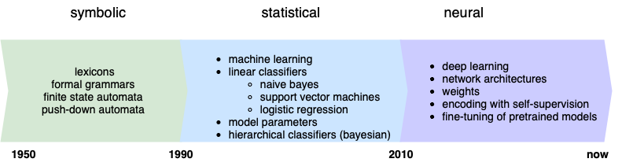
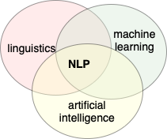

Tanja Samardžić, University of Geneva, Autmn 2022, Lecture notes

# Introduction to NLP   
# (Traitement automatique du langage naturel - TALN)  

&nbsp; 

Online textbooks:
- Dan Jurafsky and James H. Martin: [Speech and Language Processing (3rd ed. draft)](https://web.stanford.edu/~jurafsky/slp3/)
- Jacob Eisenstein: [Natural Language Processing](https://github.com/jacobeisenstein/gt-nlp-class/blob/master/notes/eisenstein-nlp-notes.pdf)
- Yoav Goldberg: [A Primer on Neural Network Models for Natural Language Processing](https://u.cs.biu.ac.il/~yogo/nnlp.pdf)
- Tom Mitchell: [Machine Learning](https://www.cs.cmu.edu/afs/cs.cmu.edu/user/mitchell/ftp/mlbook.html) - an old classics

Blogs and other learning resources:
- Lena Voita's [NLP course](https://lena-voita.github.io/nlp_course.html#main_page_content)
- Hugging Face [Course](https://huggingface.co/course/chapter1/1)
- [Jay Alammar's blog](http://jalammar.github.io)
- [Serrano Academy](https://serrano.academy) 
- YouTube channel [3blue1brown](https://www.youtube.com/c/3blue1brown)

&nbsp; 

&nbsp;

 **LECTURES** 

## 1. History of NLP, interdisciplinarity, current pipeline

&nbsp; 

### Three big eras in the history of NLP

&nbsp; 

### NLP at the intersection of three disciplines 

- Computational Linguistics is more about text **parsing**, NLP more about **end user** tasks. 
- Machine learning is a set of methods and techniques used to parse text and perform end-user tasks.
- End-user tasks are an important part of artificial intelligence because language is the most prominent capacity of human intelligence. 

(More explanations in Eisenstein)  

&nbsp; 

### Current pipeline

---

&nbsp; 

## 2. NLP tasks, data sets, benchmarks

&nbsp; 

### Text parsing 

- Parsing levels:
   - tokenisation
   - lemmatisation, normalisation
   - morphology, part-of-speech (PoS)
   - syntax (dependency today, previously constituency)
   - semantic roles 
   - coreference 
- Examples of parsing levels: [CoNLL-U format for Universal Dependencies](https://universaldependencies.org/format.html)
- Text parsing previously considered to be input to end-user tasks, but its role is not so clear today.
- The only level that is still performed is tokenisation, in fact, [subword tokenisation](https://huggingface.co/docs/transformers/tokenizer_summary). 

&nbsp; 

### End-user tasks

- Examples in the [HuggingFace tutorial](https://huggingface.co/course/chapter1/3?fw=pt): 
    - sentiment analysis
    - text generation
    - mask filling
    - named entity recognition
    - question answering
    - summarisation 
    - translation
- Famous benchmarks and data sets:
    - [GLUE](https://gluebenchmark.com/tasks)
    - [SQuAD](https://rajpurkar.github.io/SQuAD-explorer/)
    - [SNLI](https://nlp.stanford.edu/projects/snli/)
    - [COPA](https://people.ict.usc.edu/~gordon/copa.html)

--------------

&nbsp; 

## 3. Evaluation, data splits 

--------------

&nbsp; 

## 4. Text encoding with Transformers NNs 

--------------

&nbsp; 

## 5. Performing tasks with pretrained models

--------------

&nbsp; 

## 6. History of language modelling

--------------

&nbsp; 

## 7. History of NN architectures: LSTMS, CNNs 

--------------

&nbsp; 

## 8. Multimodal processing (vision, speech) 

--------------

&nbsp; 

## 9. What is knowledge about language?

--------------

&nbsp; 

## 10. What linguistic knowledge is contained in LLMs

--------------

&nbsp; 

## 11. Multilingual NLP 

--------------

Dates: 

| 29.09 &nbsp;  | 06.10  &nbsp; | 13.10 &nbsp; | 20.10 &nbsp; | 27.10 &nbsp; | 03.11 &nbsp; | 10.11 &nbsp; | 17.11 &nbsp; | 24.11 &nbsp; | 01.12 &nbsp; | 08.12 &nbsp; | 15.12 &nbsp; | 22.12 &nbsp;  | 
| ---- | ---- |  ---- |  ---- |  ---- |  ---- |  ---- |  ---- | ---- |  ---- |  ---- |  ---- | ---- |
| 1     | 2     |       3  | 4  | 5     |    6  |    7  |    8  |     9 |   10  |   |   11  |    | 

---

 **TPs** 

## 1. Classifying words with a perceptron 

**Submission deadline: 12.10 end of the day** 

Upload to Moodle (to be created):
- your Python script (named `tp1.py`)
- your weights as a text file, one number per line, named `weights_tp1.txt`    

The goal of this exercise is to consolidate the basic notions of machine learning (input instance space, weight vector, weight updating, error, learning rate) by implementing a perceptron classifier. 

We will classify a given set of words into two classes: those more associated with war and those more associated with peace. For this, we have provided the training data, which you can find in the file `tp_perceptron_input.txt`. As you will notice, B-words (= features) are proper names in this case and the T-words (objects of classification) are various nouns. All the words and the counts are extracted from the novel "War and Peace" by Leo Tolstoy.

Your task is write a Python script that takes as input a co-occurrence matrix (feature matrix) and finds the optimal weights for a sigmoid perceptron-like classifier described in the materials above. To solve this task, you are allowed to copy parts of the code from the notebook, but you will need to find out yourself how to:

- Initialise the weights (e.g. how many you need)
- Calculate the output
- Calculate the error
- Update the weights as a function of the error (use the same formula as in the tutorial)
- Define the stopping criterion

**Note**: Please make sure that we can run your script from the command line. The input file should be passed as an argument from the command line too. 

&nbsp; 

### Background

1. Jan Šnajder: [Machine learning basics](https://nbviewer.org/github/jsnajder/MachineLearningTutorial/blob/master/Machine%20Learning%20Tutorial.ipynb) 
2. Luis Serrano: [Logistic regression and the perceptron algorithm](https://www.youtube.com/watch?v=jbluHIgBmBo&t=3s), video.
3. Chrisfof Bless: [Perceptron - simple example](https://nbviewer.jupyter.org/github/Christof93/perceptron/blob/master/perceptron_algorithm.ipynb) 

---

## 2. Language modelling

&nbsp; 

### Background

---

## 3. Semantic similarity 

&nbsp; 

### Background

---

## 4. ??? 

&nbsp; 

### Background

---

