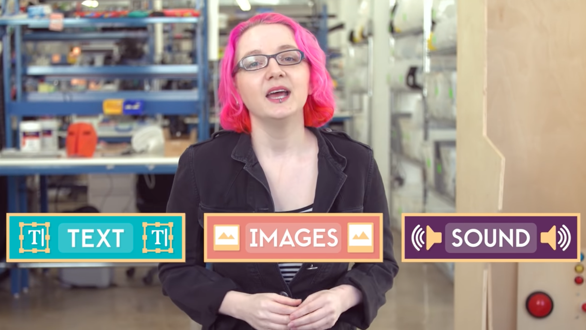
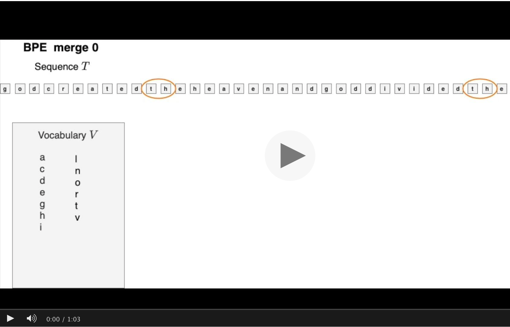
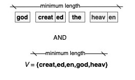

Tanja Samardžić, University of Geneva, Autmn 2022, Lecture notes

# Introduction to NLP   
# (Traitement automatique du langage naturel - TALN)  

These notes should be used as a guide for acquiring the most important notions and terminology in contemporary  Natural Language Processing. Most of the notions mentioned in the notes are explained in the listed sources. A few visualisations are included in the notes for a better overview and intuitive understanding. This course includes a practical part too, which is managed on [Moodle](https://moodle.unige.ch/course/view.php?id=14314).

&nbsp; 

(child-page-test)[https://tsamardzic.github.io/nlp_intro/1]

> Online textbooks:
> - Dan Jurafsky and James H. Martin: [Speech and Language Processing (3rd ed. draft)](https://web.stanford.edu/~jurafsky/slp3/)
> - Jacob Eisenstein: [Natural Language Processing](https://github.com/jacobeisenstein/gt-nlp-class/blob/master/notes/eisenstein-nlp-notes.pdf)
> - Yoav Goldberg: [A Primer on Neural Network Models for Natural Language Processing](https://u.cs.biu.ac.il/~yogo/nnlp.pdf)
> - Tom Mitchell: [Machine Learning](https://www.cs.cmu.edu/afs/cs.cmu.edu/user/mitchell/ftp/mlbook.html) - an old classic
> 
> Blogs and other learning resources:
> - Lena Voita's [NLP course](https://lena-voita.github.io/nlp_course.html#main_page_content)
> - Hugging Face [Course](https://huggingface.co/course/chapter1/1)
> - [Jay Alammar's blog](http://jalammar.github.io)
> - [Serrano Academy](https://serrano.academy) 
> - YouTube channel [3blue1brown](https://www.youtube.com/c/3blue1brown)
> - YouTube channel [Crash Course Linguistics](https://youtube.com/playlist?list=PL8dPuuaLjXtP5mp25nStsuDzk2blncJDW)

&nbsp; 

&nbsp;

 **LECTURES** 

## 1. History of NLP, interdisciplinarity, current pipeline

&nbsp; 

### Three big eras in the history of NLP

&nbsp; 

### NLP at the intersection of three disciplines 

- Computational Linguistics is more about text **parsing**, NLP more about **end user** tasks. 
- Machine learning is a set of methods and techniques used to parse text and perform end-user tasks.
- End-user tasks are an important part of artificial intelligence because language is the most prominent capacity of human intelligence. 

(More explanations in Eisenstein)  

&nbsp; 

### Current pipeline

---

&nbsp; 

## 2. NLP tasks, data sets, benchmarks

&nbsp; 

### Text parsing 

- Parsing levels:
   - tokenisation
   - lemmatisation, normalisation
   - morphology, part-of-speech (PoS)
   - syntax (dependency today, previously constituency)
   - semantic roles 
   - coreference 
- Examples of parsing levels: [CoNLL-U format for Universal Dependencies](https://universaldependencies.org/format.html)
- Text parsing previously considered to be input to end-user tasks, but it's roles is not so clear today

&nbsp; 

### End-user tasks

- Examples in the [HuggingFace tutorial](https://huggingface.co/course/chapter1/3?fw=pt): 
    - sentiment analysis
    - text generation
    - mask filling
    - named entity recognition
    - question answering
    - summarisation 
    - translation
- Famous NLU benchmarks and data sets:
    - [GLUE](https://gluebenchmark.com/tasks)
    - [SQuAD](https://rajpurkar.github.io/SQuAD-explorer/)
    - [SNLI](https://nlp.stanford.edu/projects/snli/)
    - [COPA](https://people.ict.usc.edu/~gordon/copa.html)

--------------

&nbsp; 

## 3. Evaluation, data splits 

> Explanations and formulas: 
> - Eisenstein 2.4 (ignore Naive Bayes), 3.2.3, 4.4 (ignore significance), 4.5, 6.4.2
> - Jurafsky-Martin 4.7, 16.5 

&nbsp; 

### Two main kinds of evaluation in NLP 

&nbsp; 

1. Label comparison in a confusion matrix - usual setting in machine learning in general 

&nbsp; 

2. Comparing sequences - more specific to NLP, more complicated 

&nbsp; 

&nbsp; 

### Three points where we measure the error

1. On the **train** set -> **loss**, training error for setting **model parameters (weights)**  
2. On the **dev** set  -> no standard term, but can be thought as *interim performance*, sometimes called *validation*, error measured for setting **hyperparameters**, e.g. the weight of a component in a processing pipeline, learning rate for weight updating, training duration etc. 
3. On the **test** set -> **performance**, importantly, an **estimate** of the performance!

Only the last point is evaluation. 

&nbsp; 

### Two most frequent measures for loss

1. Maximum likelihood -> minimising negative log likelihood  
2. Cross-entropy  -> minimising conditional log likelihood

&nbsp; 

### Measures for performance estimation   

- For comparing single labels (confusion matrix)
    1. Precision
    2. Recall 
    3. F-score 
    4. Accuracy 

- For comparing sequences with a reference
    1. Error rate in speech-to-text 
    2. [BLEU](https://en.wikipedia.org/wiki/BLEU) in machine translation 
    3. [ROUGE](https://en.wikipedia.org/wiki/ROUGE_(metric)) in machine translation, text summarisation 

- For sequences without a reference (language modelling)
    1. Perplexity 

&nbsp; 

### The baseline 

When evaluating a NLP system, we want to know whether it performs **better than another system**. There is no point in reporting scores without a comparison. If no other system exists, then we compare our system to a simple solution, which does not involve learning. This simple solution is called the **baseline**. An example of such a simple solution is the *majority class baseline* -- putting all test items in a single class, the one that is most frequently seen in the training set. 

&nbsp; 

### Common mistakes in evaluation  

- "I get 78% accuracy - not bad!" >> not bad compared to what?!
- "My system is not so good on the dev set, but it nails it on the test!" >> your system got lucky with the test set 
- "I'm happy with the accuracy, but I don't like the F-score (so I'm not going to report it)" >> there is probably one frequent label that your system gets well, but not the others   

--------------

&nbsp; 

## 4. Text encoding with Transformers NNs 

> Explanations, formulas, visualisations: 
> -  Jay Alammar's blog: [The Illustrated Transformer](http://jalammar.github.io/illustrated-transformer/)
> -  Jurafsky-Martin [9.7](https://web.stanford.edu/~jurafsky/slp3/9.pdf)
> -  Lena Voita's blog: [Sequence to Sequence (seq2seq) and Attention](https://lena-voita.github.io/nlp_course/seq2seq_and_attention.html)

&nbsp; 

### Better, contextual, "dynamic" (sub)word vectors 

- We basically represent sequences of symbols (subwords), not single words
- The result of text encoding with Transformers is a representation for each subword segment in the given sentence. This is a dynamic representation because it depends on the sentence as opposed to "static" representations (e.g. word2vec).
- With the self-attention mechanism, we can extract more information from the context, we can select more relevant contexts.  

&nbsp; 

### Generalised attention

- The notion of attention comes from encoder-decoder RNNs built for machine translation: it allows the decoder to select the most relevant encoder states when generating the output. 
- Generalised as self-attention this mechanism allows to find the most relevant contexts for encoding the input. 
- It helps increases parallel computation because the input sequence (e.g. a sentence) is broken down into many pairs of words; we can disregard the order of words. 

&nbsp; 

### Training with self-supervision 

- masked language modelling as a training goal (objective, task) 
- cross-entropy (comparing probability distributions) as a loss function

&nbsp; 

### Subword tokenization

- Control over the size of the vocabulary
- Dealing with unknown words
- discussed in more detail in Lecture 10

&nbsp; 

### Implementation aspects, reasons for the large number of parameters

- multihead attention: need to repeat the attention mechanism several times, with varied parameter initialisations  
- positional encoding: an additional function needed to make up for disregarding the order of words 
- stacked FFNNs encoders: need to repeat the whole encoding process several times to achieve good results  

--------------

&nbsp; 

## 5. History of language modelling

> Explanations, formulas, visualisations: 
> - Lena Voita's blog: [Language Modelling](https://lena-voita.github.io/nlp_course/language_modeling.html)
> - Eisenstein 6 (ignore details of NN architectures for now)
> - Jurafsky-Martin [3](https://web.stanford.edu/~jurafsky/slp3/3.pdf) 

&nbsp; 

### Language as a stochastic process 

&nbsp; 

- in the framework of information theory
- view of text as a sequence of symbols generated by an encoder 
- by modelling the sequence, we model the encoder 
- initially only concerned with the form of the language

&nbsp; 

### Statistical or n-gram models

- the focus on the form, sometimes called the "grammar" 
- focus on the order (like time sequences)
- first used in automatic speech recognition (ASR), then in statistical machine translation (SMT) 
- assumptions of probability distributions
- independence assumptions -> Markov models
- the problem of zero counts -> smoothing

&nbsp; 

### Neural language models 

- initially focus on the form
- still focus on the order
- self-supervised RNNs
- later weights as a representation of meaning 

&nbsp; 

### Masked language modelling (MLM)

- instead of predicting the next word, the model predict a set of randomly masked words <- word order is not explicitly modelled 
- focus on the meaning in context
- word2vec: first step, static embeddings
- BERT-like models: current technology behind LLMs, dynamic embeddings 

&nbsp; 

### Large language models (LLMs)

- general encoders 
- all MLM (or a similar)
- still open question to what degree they model human linguistic competence 

&nbsp; 

### Statistical vs. neural 

- statistical still used in practice for ASR: fast and well understood 
- neural models are used for other text generation tasks: machine translation, summarisation, robot-writers

--------------

&nbsp; 

## 6. History of NN architectures: CNNs, LSTMs 

> Explanations, formulas, visualisations: 
> - Goldberg 9, 10, 11
> - Eisenstein 3.4, 6 
> - Jurafsky-Martin [9](https://web.stanford.edu/~jurafsky/slp3/9.pdf)
> - Lena Voita's blog: [Text Classification](https://lena-voita.github.io/nlp_course/text_classification.html)

&nbsp; 

### CNNs as feature extractors 

- designed to identify relevant input features
- specifically in NLP: relevant segments of text are found with **1D** convolutions
- **convolution** produces one vector representation for each n-gram
- each filter is responsible for one cell in the vector, dimensionality of n-gram vector is the number of filters  
- n-gram representations are then **pooled** into a single vector representing the whole text
- this vector is input to a classifier 
- n-gram size ≠ filter size!

&nbsp; 

### CNNs are mostly used for text classification

- e.g. spam filtering, sentiment
- a class is assigned to a whole text or a sentence
- specific n-grams are clues for the class of the whole text 

&nbsp; 

### (bi-)LSTMs as encoders and decoders 

- LSTMs are sophisticated RNNs 
- RNNs are designed to process sequences, when the order of symbols is important 
- remove the need for Markov models 
- layers are states or units ordered in time steps 
- RNN abstraction: current state = current input +  previous state 
- by design uni-directional, in NLP mostly used as bi-directional: concatenation of the left-to-right and right-to-left pass
- gating is invented to control how much history is allowed to pass to the next state
- LSTM is a kind of gating: each state consists of a hidden and a memory component
- input, forget, output   

&nbsp; 

### LSTMs are mostly used for generating sequences 

- e.g. named entity recognition, PoS
- because they can output a symbol at each state  
- encoder-decoder versions can produce sequences of varied length 
- to be used for classification, the last state is taken as the representation of the whole sequence  

--------------

&nbsp; 

## 7. Performing tasks with pre-trained models

> Explanations and visualisations: 
> - Jurafsky-Martin [11](https://web.stanford.edu/~jurafsky/slp3/11.pdf)
> - Lena Voita's blog: [Transfer Learning](https://lena-voita.github.io/nlp_course/transfer_learning.html#bert)
> - Jay Alammar's blog: [A Visual Guide to Using BERT for the First Time](http://jalammar.github.io/a-visual-guide-to-using-bert-for-the-first-time/)

&nbsp; 

&nbsp; 

### Before Large Language Models (LLMs) 

- statistical models were pre-trained and shared, but strictly task-specific 
- joint or multi-task learning: find the parameters that minimise two losses, e.g. PoS and lemma   
- parameter sharing in neural networks: part of the network shared between two tasks (their loss combined used for wight updating)

&nbsp; 

### With LLMs

- consecutive transfer: first pre-train a LLM, then the main model with LLM as input  
- a LLM is trained on raw text with self-supervised learning  
- the main model is trained on labelled data (most of the time) with supervised learning

&nbsp; 

### Options for how to use LLMs

- Fine-tuning: This term is typically used in cases where the learning objective (task) used for pre-training LLM is different from the objective (task) on which the main model is trained. For example, a typical task for pre-training LLMs is masked language modelling (MLM), while the main model is trained for text classification or sentiment analysis. All weights are updated with the main model's loss. 
- Continued training: This term is used in cases where a pre-trained LLM is used to improve text representation on a new domain or a new language. In this case, the the learning objective is the same for the pre-trained LLM and the main LM (e.g. we use MLM in both cases), but pre-training and main training are done on different data sets. All weights are updated with the main model's loss.
- One- and few-shot learning, also known as meta-learning: pre-trained LLM performs the main task without updating parameters. A pre-trained LLM learns to classify new examples relying on a similarity function. This terminology is very new, not yet summarised in a textbook. An overview of terms and references can be found in [Timo Schick's PhD thesis](https://edoc.ub.uni-muenchen.de/29867/1/Schick_Timo.pdf)
- Zero-shot classification: unsupervised setting without updating LMMs parameters. 

&nbsp; 

### LLMs model types

- model architecture types:
   - only the encoder part of Transformers  (e.g. BERT, RoBERTa)
   - only the decoder part of Transformers (e.g. GPT)
   - full encoder-decoder Transformers (e.g. t5)
- training objective:
  - masked language modelling (e.g. BERT, RoBERTa)
  - discriminating between alternative fillings of slots (e.g. ELECTRA)
  - reconstructing the input after permutations (e.g. XLNet)
- model size
  - several models are trained using fewer parameters (e.g. DistilBERT) 

&nbsp; 

### LLMs source data and type

- English (Wikipedia and BooksCorpus):  bert-base, cased and uncased
- French: FlauBERT (BERT), CamemBERT (RoBERTa), variants
- Bosnian, Croatian, Montengrin, Serbian: BERTić (ELECTRA), trained on almost all the texts available online 
- many, many more!

--------------

&nbsp; 

## 8. Multimodal processing (a high-level overview) 

> Explanations and visualisations: 
> - Jurafsky-Martin [16](https://web.stanford.edu/~jurafsky/slp3/16.pdf)
> - Awni Hannun: [Sequence Modeling with CTC](https://distill.pub/2017/ctc/), online tutorial 
> - Ray Smith: [An Overview of the Tessarct OCR Engine](https://github.com/tesseract-ocr/docs/blob/main/tesseracticdar2007.pdf)
> - [ImageNet](https://www.image-net.org/about.php)

&nbsp;

### Relation to NLP and options

- Not core NLP, but increasingly relevant
- NLP research typically on post-processing, correcting recognition errors with language modelling 
- Conversion of different data formats into text  <- much more developed 
- Fusion of multimodal features <- some attempts for some tasks, but not widely spread 

&nbsp;
 
### Common steps

- Feature extraction: all inputs are represented with features
- Classification: finding the best label given the features
- Sequencing (language modelling): scoring the sequence of labels 
- Move from pipelines to end-to-end:
  - pipeline: different tools for each step, often put together in a processing "recipe"
  - end-to-end: one huge NN performs all the steps

&nbsp; 

### Speech 

- ASR: automatic transcription, subtitling 
- TTS (text-to-speech): vocal announcements, audio descriptions  
- Features: properties of sound ways 
- Labels: phonemes, IPA, more often [SAMPA](https://www.phon.ucl.ac.uk/home/sampa/index.html) 
- Technology: [Kaldi](https://kaldi-asr.org) for pipeline, many end-to-end, e.g. [wav2vec](https://huggingface.co/docs/transformers/model_doc/wav2vec2)

&nbsp; 

### Image 

- Optical Character Recognition (OCR): an old task, still very important in Digital Humanities 
- ImageNet classification, based on [WordNet](https://wordnet.princeton.edu/)
- Features: pixel analyses
- Labels: typesetting prototypes (for OCR), WordNet synsets (representing concepts) 
- Text to image: DALL-E (a short explanation in this [Vox video](https://youtu.be/SVcsDDABEkM) suggested by Alexander)

--------------

## 9. What is knowledge about language?

Explanations and visualisations 
> - Crash Course Linguistics [#1](https://youtu.be/3yLXNzDUH58), [#14](https://youtu.be/Nxyo83cQjhI) 
> - Revisiting research training in linguistics: theory, logic, method, [Unit 01_01](https://tube.switch.ch/videos/516dcd9e), [Unit 01_02](https://tube.switch.ch/videos/83e51806), [Unit 01_03](https://tube.switch.ch/videos/27315c6e), [Unit 01_04](https://tube.switch.ch/videos/34e4ff9f), [Unit 02_01](https://tube.switch.ch/videos/7ddb6d52) 
> - T. Samardžić blog: [Kinds of languages](https://github.com/tsamardzic/lsampling#part-2) 
> - O. Pelloni, Language properties and parameters, PhD thesis, [Ch2](https://drive.switch.ch/index.php/s/wxrCjWq7BFvqhAl) 

&nbsp; 

### Grammar vs. linguistics 
 
- Grammar is what we study in school: rules of a single language
- Linguistics is about explaining why grammars are the way they are
  - What is common to all grammars? 
  - Why are some sequences of words ungrammatical? 
- Big gap between theory and grammar
- Most of what is called "linguistics" is about grammars (not theoretical) 

&nbsp; 

### Most important theoretical notions

- Arbitrariness of the sign: there is no natural connection between a word and its meaning, 
    - but the [Bouba/kiki effect](https://en.wikipedia.org/wiki/Bouba/kiki_effect) shows some connection 
- Double articulation (duality of patterning): merging meaningless units into meaningful ones, merging meaningful units into higher-order meaningful units
    - sometimes only the latter regarded as language
    - relevant to the question of what are the smallest units of language  
- Displacement: we can talk about things we don't see 
    - but it seems that we don't use this freedom all the time, a short video about that (by me): [What you see is what you say, or is it?](https://tube.switch.ch/videos/d72fe3cd)  
    - relevant to the question what knowledge can be extracted from texts
- Innateness: are we born with a specialised language faculty or it's all just general cognition? 
    - a famous puzzle: [Poverty of the stimulus](https://en.wikipedia.org/wiki/Poverty_of_the_stimulus)
    - distantly relevant to generalisation and universality of NLP models

&nbsp; 

### Most important terminology in linguistics and the corresponding NLP tasks

- Phonetics describes physical properties of sounds (place of articulation, pitch, duration, intonation, etc.), phonology describes rules over abstract sound representations
    - NLP task: ASR  
- Morphology describes the rules of word formation (derivation, inflection) 
    - NLP tasks: stemming, lemmatisation, subword tokenization 
- Syntax describes the rules of sentence formation (dependencies between words), can be constituency or dependency trees  
    - NLP task: parsing 
- Semantics deals with meanings, can be lexical (meaning of words) or propositional (meaning of sentences) 
    - NLP tasks: word sense disambiguation, semantic role labelling, co-reference resolution  
- Pragmatics deals with meaning in context: how we understand non-explicit meanings 
    - NLP task: intent classification 
- Discourse analysis describes the rules of combining sentences into higher structures 
    - NLP task: dialogue and interactive systems (chat bots), identifying discourse relations 
- Sociolinguistics: linguistic differences between social groups (e.g. young vs. old speakers, men vs. women, degrees of education)  
    - NLP task: computational sociolinguistics (classifying social media users)
- Psycholinguistics, neurolinguistics: where is language located in the brain? what structures are harder for the brain to process? 
    - NLP task: cognitive modelling (simulating human language processing) 
- Language acquisition: how language develops in children 
    - NLP task: cognitive modelling (simulating human language processing)
- Second language acquisition: how is a foreign language learnt 
    - no particular NLP task   
 
&nbsp; 

### Linguistic diversity 

- Genealogical comparison: language families
- Feature-based comparison, e.g. [lang2vec](https://github.com/antonisa/lang2vec)
- Text-based comparison
   - Shannon entropy and complexity 
   - Zipf-Mandelbrot Law 
   - Menzerath-Altmann’s Law
 
&nbsp; 

### Linguistics vs. NLP

- Symbolic rule-based methods relied a lot on grammars
- Statistical methods used annotated texts, Penn Treebank was an example for many others, now Universal Dependencies 
- Both rules and annotations are slightly formalised grammars, not scientific theory 
- LLMs and self-supervised learning often work without any explicit linguistic knowledge 
- Popular question: is there still any room for linguistics in NLP?

--------------

&nbsp; 

## 10. Subword tokenization as a linguistic question in NLP 

> Explanations and visualisations: 
> - Jurafsky-Martin [2.3](https://web.stanford.edu/~jurafsky/slp3/2.pdf)
> - Hugging Face [Tokenizers library](https://huggingface.co/course/chapter6/1?fw=pt)
> - Morfessor short [Background](http://morpho.aalto.fi/projects/morpho/problem.html) and [Methods](http://morpho.aalto.fi/projects/morpho/methods.html)  

&nbsp; 

### Why is text segmentation not trivial?

Source: [Khan Academuy](https://www.khanacademy.org/computing/computers-and-internet/khan-academy-and-codeorg-binary-data)

- Text is segmented into tokens (compared to frames in sound processing, pixels in image processing)
- How should we split texts into tokens? 
- Word as a token: too naive, overestimating the size of the vocabulary
    - *fast* and *faster* equally distinct as *fast* and *water* 
    - what is a word? 
    - much less clear in languages other than English  

&nbsp; 

### The problem of out-of-vocabulary (OOV) words

- Follows from Zipf's law: most of words are rare
- Following from information theory: rare words are long
- Subword tokenization as a solution: split words into smaller segments
- New problem: How to split words? What should be subword units? 
- Morphology in linguistics: words should not be analysed into morphemes; the structure of morphological paradigms   

&nbsp; 

### The trade-off between data (=text) size and vocabulary size 

- Following from information theory: the shorter the symbol the more re-occurrence 
- If there are regular patterns, they will re-occur more than expected from the general information theory
- If symbols are short and re-occurring -> small vocabulary, more evidence for estimating probability, but data longer
- If symbols are long -> big vocabulary, little evidence for estimating probability, but data shorter   
- The goal of subword segmentation: find the optimal symbols minimising both sizes (data and vocabulary) 

&nbsp;  

### Compression algorithms  

- Byte-Pair Encoding (BPE)
    - Starts with Unicode characters as symbols and pre-tokenization (word-level)
    - Iterates over data, in each iteration creates one new symbol
    - Each new symbol is introduced as a replacement for the most frequent bigram of symbols  
- WordPiece
    - Starts with Unicode characters as symbols and pre-tokenization (word-level)
    - Iterates over data, in each iteration creates one new symbol
    - Each new symbol is introduced as a replacement for the bigram of symbols with the highest association score (similar to mutual information)     

&nbsp; 

### Probability models 

- Start with all possible splits in theory, in practice, from a sample of all possible splits
- Eliminate symbols that contribute least to increasing the log probability of the data 
- Morfessor 
    - More popular in earlier work on morphological segmentation 
    - Can be tuned to put more weight on minimising either vocabulary or data size 
- Unigram model 
    - Currently very popular 
    - Vocabulary size an explicit hyper-parameter 

 
&nbsp; 

### Practical tips

- BPE good for consistent, more regular data
- Unigram better for noisy data
- WordPiece merges more lexical items (roots) 
- Vocabulary size often decided as a function of the data size, sometimes as a proportion of the word-level vocabulary 
- BPE and Unigram implemented in the SentencePiece library 
- WordPiece used for BERT 
 
--------------

&nbsp; 

## 11. Multilingual NLP 

Explanations and visualisations 
> - Sebastian Ruder's blog: [Why You Should Do NLP Beyond English](https://ruder.io/nlp-beyond-english/index.html)
> - T. Samardžić blog: [Why language sampling](https://github.com/tsamardzic/lsampling#2-why-sampling) 
> - Sebastian Ruder's blog: [The State of Multilingual AI](https://ruder.io/state-of-multilingual-ai/index.html)
> - Crash Course Linguistics [#16](https://youtu.be/-sUUWyo4RZQ)

&nbsp; 

### Reasons for studying multilingual NLP 

- societal and economic: people like to interact with the technology in their native language/accent; more varieties covered, more users reached  
- linguistic and machine learning: bigger challenges lead to better approaches, e.g. subword tokenisation  
- cultural and normative: better representation of the real world knowledge
- cognitive: learn interlingual abstractions  

&nbsp; 

### Multilingual data sets 

- Universal Dependencies (UD) 106 languages, 20 families,  Bias towards Eurasia recognised but not intended
- Bible 100, 103 languages, 30 families, Majority non-Indo-European  
- mBERT, 97 languages, 15 families, Top 100 size of Wikipedia plus Thai and Mongolian
- XTREME,  40 languages, 14 families,  Diversity 
- XGLUE, 19 languages, 7 families 
- XNLI, 15 languages, 7 families, Span families, include low resource languages
- XCOPA,  11 languages, 11 families, Max diversity 
- TyDiQA, 11 languages, 10 families, Typological diversity
- XQuAD, 12 languages, 6 families, Extension to new languages

&nbsp; 

### Transfer across languages 

- a pre-trained LLM can be multilingual
- popular examples mBERT, mT5, XLM-R, Bloom -> mostly Wikipedia languages (around 100) 
- often a group of languages, e.g. Indic BERT
- trade-off between the size of the training data and the closeness to the target language ### Multilingual models

&nbsp; 

 

&nbsp; 

### Language similarity and sampling

&nbsp; 

- Are languages included in data sets and models representative of all structural types?
- How to get a representative sample? How to compare languages?
- What are good transfer-target pairs? Why? 

--------------

&nbsp; 

&nbsp; 

## Dates: 

| 29.09 &nbsp;  | 06.10  &nbsp; | 13.10 &nbsp; | 20.10 &nbsp; | 27.10 &nbsp; | 03.11 &nbsp; | 10.11 &nbsp; | 17.11 &nbsp; | 24.11 &nbsp; | 01.12 &nbsp; | 08.12 &nbsp; | 15.12 &nbsp; | 22.12 &nbsp;  | 
| ---- | ---- |  ---- |  ---- |  ---- |  ---- |  ---- |  ---- | ---- |  ---- |  ---- |  ---- | ---- |
| 1     | 2     |       3  | 4  | 5     |    6  |    7  |    8  |     9 |   10  |   |   11  |    | 

---

