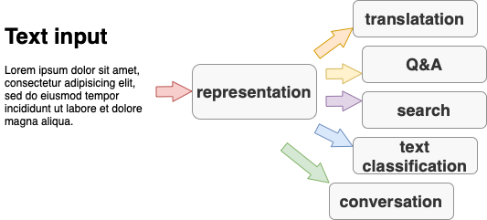

Tanja Samardžić, University of Geneva, Autmn 2022, Lecture notes

# Introduction to NLP (Traitement automatique du langage naturel - TALN)  

- Computational Linguistics
- Machine learning: [Simple examples](https://nbviewer.org/github/jsnajder/MachineLearningTutorial/blob/master/Machine%20Learning%20Tutorial.ipynb) 
- Artificial Intelligence 

---

## Plan for the course

1. History of NLP, interdisciplinarity, current status

### Practice and research in NLP 

2. NLP tasks, performance evaluation 
3. Data sets, splits, benchmarks 

### Models (Machine learning for NLP)

4. Text encoding with Transformers NNs 
5. Performing tasks with pretrained models
6. History of language modelling
7. History of NN architectures: LSTMS, CNNs 
8. Multimodal processing (vision, speech) 

### Linguistics and NLP

9. What is knowledge about language 
10. What linguistic knowledge is contained in LLMs
11. Multilingual NLP 

Dates: 

29.09
06.10
13.10
20.10
27.10
03.11
10.11
17.11
24.11
01.12
08.12
15.12
22.12

---

## Plan for the TPs

---

### 1. Classifying words with a perceptron 

**Submission deadline: 12.10 end of the day** 

Upload to Moodle:
- your Python script (named `tp1.py`)
- your weights as a text file, one number per line, named `weights_tp1.txt`    

The goal of this exercise is to consolidate the basic notions of machine learning (input instance space, weight vector, weight updating, error, learning rate) by implementing a perceptron classifier. 

**Explanations**: 
- Luis Serrano: [Logistic regression and the perceptron algorithm](https://www.youtube.com/watch?v=jbluHIgBmBo&t=3s), video.
- [Simple example](https://nbviewer.jupyter.org/github/Christof93/perceptron/blob/master/perceptron_algorithm.ipynb) 

We will classify a given set of words into two classes: those more associated with war and those more associated with peace. For this, we have provided the training data, which you can find in the file `tp_perceptron_input.txt`. As you will notice, B-words (= features) are proper names in this case and the T-words (objects of classification) are various nouns. All the words and the counts are extracted from the novel "War and Peace" by Leo Tolstoy.

Your task is write a Python script that takes as input a co-occurrence matrix (feature matrix) and finds the optimal weights for a sigmoid perceptron-like classifier described in the materials above. To solve this task, you are allowed to copy parts of the code from the notebook, but you will need to find out yourself how to:

- Initialise the weights (e.g. how many you need)
- Calculate the output
- Calculate the error
- Update the weights as a function of the error (use the same formula as in the tutorial)
- Define the stopping criterion

**Note**: Please make sure that we can run your script from the command line. The input file should be passed as an argument from the command line too. 

---

2. Language modelling
3. Semantic similarity 
4. ??? 

